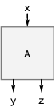
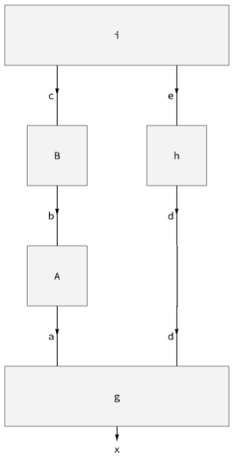
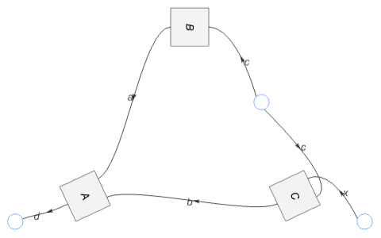
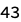
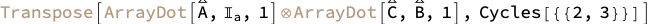
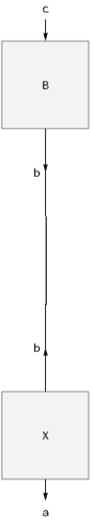
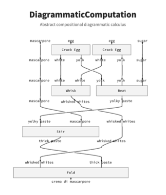

## Details & Options

- A [Diagram](https://resources.wolframcloud.com/PacletRepository/resources/Wolfram/DiagrammaticComputation/ref/Diagram) is a symbolic process with typed input and output [Port](https://resources.wolframcloud.com/PacletRepository/resources/Wolfram/DiagrammaticComputation/ref/Port)s — a morphism in a symmetric monoidal category. Diagrams compose sequentially ([DiagramComposition](https://resources.wolframcloud.com/PacletRepository/resources/Wolfram/DiagrammaticComputation/ref/DiagramComposition)), in parallel ([DiagramProduct](https://resources.wolframcloud.com/PacletRepository/resources/Wolfram/DiagrammaticComputation/ref/DiagramProduct)), additively ([DiagramSum](https://resources.wolframcloud.com/PacletRepository/resources/Wolfram/DiagrammaticComputation/ref/DiagramSum)), or orderlessly by port name ([DiagramNetwork](https://resources.wolframcloud.com/PacletRepository/resources/Wolfram/DiagrammaticComputation/ref/DiagramNetwork)).
- Composite diagrams render as 2D grids ([DiagramGrid](https://resources.wolframcloud.com/PacletRepository/resources/Wolfram/DiagrammaticComputation/ref/DiagramGrid)) or single nodes ([DiagramGraphics](https://resources.wolframcloud.com/PacletRepository/resources/Wolfram/DiagrammaticComputation/ref/DiagramGraphics)); arbitrary networks arrange into grids automatically by inserting identities, permutations, caps, cups and spiders ([DiagramArrange](https://resources.wolframcloud.com/PacletRepository/resources/Wolfram/DiagrammaticComputation/ref/DiagramArrange)).
- Diagrams convert to and from other compositional structures: graphs, trees, hypergraphs, neural networks and system models via [ToDiagram](https://resources.wolframcloud.com/PacletRepository/resources/Wolfram/DiagrammaticComputation/ref/ToDiagram), symbolic tensor contractions via [DiagramTensor](https://resources.wolframcloud.com/PacletRepository/resources/Wolfram/DiagrammaticComputation/ref/DiagramTensor) and [TensorDiagram](https://resources.wolframcloud.com/PacletRepository/resources/Wolfram/DiagrammaticComputation/ref/TensorDiagram), and executable dataflow functions via [DiagramFunction](https://resources.wolframcloud.com/PacletRepository/resources/Wolfram/DiagrammaticComputation/ref/DiagramFunction).
- Subdiagrams can be located, mapped over and edited ([DiagramCases](https://resources.wolframcloud.com/PacletRepository/resources/Wolfram/DiagrammaticComputation/ref/DiagramCases), [DiagramMap](https://resources.wolframcloud.com/PacletRepository/resources/Wolfram/DiagrammaticComputation/ref/DiagramMap), [DiagramReplacePart](https://resources.wolframcloud.com/PacletRepository/resources/Wolfram/DiagrammaticComputation/ref/DiagramReplacePart)) and rewritten by hypergraph-matched rules ([DiagramReplace](https://resources.wolframcloud.com/PacletRepository/resources/Wolfram/DiagrammaticComputation/ref/DiagramReplace), [DiagramRule](https://resources.wolframcloud.com/PacletRepository/resources/Wolfram/DiagrammaticComputation/ref/DiagramRule)), including the standard interaction-net rule schemas.
- The paclet depends on the [WolframInstitute/Hypergraph](https://resources.wolframcloud.com/PacletRepository/resources/WolframInstitute/Hypergraph/) paclet for rule matching.

## Usage

The paclet provides [Diagram](https://resources.wolframcloud.com/PacletRepository/resources/Wolfram/DiagrammaticComputation/ref/Diagram) and [Port](https://resources.wolframcloud.com/PacletRepository/resources/Wolfram/DiagrammaticComputation/ref/Port) with constructors [ToDiagram](https://resources.wolframcloud.com/PacletRepository/resources/Wolfram/DiagrammaticComputation/ref/ToDiagram), [TensorDiagram](https://resources.wolframcloud.com/PacletRepository/resources/Wolfram/DiagrammaticComputation/ref/TensorDiagram), [IdentityDiagram](https://resources.wolframcloud.com/PacletRepository/resources/Wolfram/DiagrammaticComputation/ref/IdentityDiagram), [PermutationDiagram](https://resources.wolframcloud.com/PacletRepository/resources/Wolfram/DiagrammaticComputation/ref/PermutationDiagram), [CapDiagram](https://resources.wolframcloud.com/PacletRepository/resources/Wolfram/DiagrammaticComputation/ref/CapDiagram), [CupDiagram](https://resources.wolframcloud.com/PacletRepository/resources/Wolfram/DiagrammaticComputation/ref/CupDiagram), [CopyDiagram](https://resources.wolframcloud.com/PacletRepository/resources/Wolfram/DiagrammaticComputation/ref/CopyDiagram), [SpiderDiagram](https://resources.wolframcloud.com/PacletRepository/resources/Wolfram/DiagrammaticComputation/ref/SpiderDiagram); compositions [DiagramComposition](https://resources.wolframcloud.com/PacletRepository/resources/Wolfram/DiagrammaticComputation/ref/DiagramComposition), [DiagramProduct](https://resources.wolframcloud.com/PacletRepository/resources/Wolfram/DiagrammaticComputation/ref/DiagramProduct), [DiagramSum](https://resources.wolframcloud.com/PacletRepository/resources/Wolfram/DiagrammaticComputation/ref/DiagramSum), [DiagramNetwork](https://resources.wolframcloud.com/PacletRepository/resources/Wolfram/DiagrammaticComputation/ref/DiagramNetwork), [RowDiagram](https://resources.wolframcloud.com/PacletRepository/resources/Wolfram/DiagrammaticComputation/ref/RowDiagram), [ColumnDiagram](https://resources.wolframcloud.com/PacletRepository/resources/Wolfram/DiagrammaticComputation/ref/ColumnDiagram); transformations [DiagramDual](https://resources.wolframcloud.com/PacletRepository/resources/Wolfram/DiagrammaticComputation/ref/DiagramDual), [DiagramFlip](https://resources.wolframcloud.com/PacletRepository/resources/Wolfram/DiagrammaticComputation/ref/DiagramFlip), [DiagramReverse](https://resources.wolframcloud.com/PacletRepository/resources/Wolfram/DiagrammaticComputation/ref/DiagramReverse), [DiagramArrange](https://resources.wolframcloud.com/PacletRepository/resources/Wolfram/DiagrammaticComputation/ref/DiagramArrange), [SimplifyDiagram](https://resources.wolframcloud.com/PacletRepository/resources/Wolfram/DiagrammaticComputation/ref/SimplifyDiagram); conversions [DiagramFunction](https://resources.wolframcloud.com/PacletRepository/resources/Wolfram/DiagrammaticComputation/ref/DiagramFunction), [DiagramTensor](https://resources.wolframcloud.com/PacletRepository/resources/Wolfram/DiagrammaticComputation/ref/DiagramTensor); surgery [DiagramCases](https://resources.wolframcloud.com/PacletRepository/resources/Wolfram/DiagrammaticComputation/ref/DiagramCases), [DiagramMap](https://resources.wolframcloud.com/PacletRepository/resources/Wolfram/DiagrammaticComputation/ref/DiagramMap), [DiagramMapAt](https://resources.wolframcloud.com/PacletRepository/resources/Wolfram/DiagrammaticComputation/ref/DiagramMapAt), [DiagramExtract](https://resources.wolframcloud.com/PacletRepository/resources/Wolfram/DiagrammaticComputation/ref/DiagramExtract), [DiagramInsert](https://resources.wolframcloud.com/PacletRepository/resources/Wolfram/DiagrammaticComputation/ref/DiagramInsert), [DiagramDelete](https://resources.wolframcloud.com/PacletRepository/resources/Wolfram/DiagrammaticComputation/ref/DiagramDelete); and rewriting [DiagramReplace](https://resources.wolframcloud.com/PacletRepository/resources/Wolfram/DiagrammaticComputation/ref/DiagramReplace), [DiagramReplaceList](https://resources.wolframcloud.com/PacletRepository/resources/Wolfram/DiagrammaticComputation/ref/DiagramReplaceList), [DiagramNestReplace](https://resources.wolframcloud.com/PacletRepository/resources/Wolfram/DiagrammaticComputation/ref/DiagramNestReplace), [DiagramRule](https://resources.wolframcloud.com/PacletRepository/resources/Wolfram/DiagrammaticComputation/ref/DiagramRule).

## Basic Examples

Create a simple diagram with one input and two output ports:

```wl
Diagram[A, x, {y, z}]
```



---

Compose diagrams in sequence and in parallel; matching port names wire together:

```wl
DiagramComposition[
  Diagram["g", {a, d}, {x}],
  DiagramProduct[DiagramComposition[Diagram["A", b, a], Diagram["B", c, b]], Diagram["h", e, d]],
  Diagram["i", {c, e}]
]
```



---

Wire diagrams into a network, joining all equivalent ports regardless of position:

```wl
DiagramNetwork[Diagram[A, {a, b}, d], Diagram[B, c, a], Diagram[C, {x, c}, b]]
```



## Scope

Annotate diagram labels with functions and run the diagram as a dataflow:

```wl
DiagramFunction[ColumnDiagram[{
  Diagram[Annotation["3", "Function" -> (3 &)], input],
  Diagram[Annotation["[2\[Times]]", "Function" -> (2 # &)], input, doubled],
  Diagram[Annotation["", "Function" -> (Sequence @@ {#, #} &)], doubled, {a, b}, "Shape" -> "Point"],
  RowDiagram[{Diagram[Annotation["[+1]", "Function" -> (# + 1 &)], a, incremented], Diagram[Annotation["[^2]", "Function" -> (#^2 &)], b, squared]}],
  Diagram[Annotation["[+]", "Function" -> Plus], {incremented, squared}, result]
}, Alignment -> Center]][]
```



---

Extract the tensor contraction a composite diagram represents:

```wl
DiagramTensor[Diagram[Diagram["A", a, b] \[CircleTimes] Diagram["C", d, e] \[CircleDot] Diagram["B", c, d]]]
```



---

Rewrite a diagram by a rule with pattern ports:

```wl
DiagramReplace[
  DiagramComposition[Diagram["A", b, a], Diagram["B", c, b]],
  Diagram["A", \[FormalY], \[FormalX]] -> Diagram["X", \[FormalY], \[FormalX]]
]
```



## Hero Image

The steps of a tiramisu cream as a dataflow diagram — matching resource names wire automatically into a process diagram:

```wl
With[{
  recipe = ColumnDiagram[{
    RowDiagram[{Diagram["Crack Egg", "egg", {"white", "yolk"}], Diagram["Crack Egg", "egg", {"white", "yolk"}], IdentityDiagram["sugar"]}],
    RowDiagram[{Diagram["Whisk", {"white", "white"}, "whisked whites"], Diagram["Beat", {"yolk", "yolk", "sugar"}, "yolky paste"]}],
    Diagram["Stir", {"yolky paste", "mascarpone"}, "thick paste"],
    Diagram["Fold", {"whisked whites", "thick paste"}, "crema di mascarpone"]
  }]
},
  ImageResize[
    Rasterize[
      Notebook[{Cell[BoxData[ToBoxes[
        Framed[
          Column[{
            Style["DiagrammaticComputation", 26, Bold, GrayLevel[0.15], FontFamily -> "Source Sans Pro"],
            Style["Abstract compositional diagrammatic calculus", 13, GrayLevel[0.45], FontFamily -> "Source Sans Pro"],
            Spacer[10],
            recipe["Grid", ImageSize -> {Automatic, 430}]
          }, Alignment -> Center, Spacings -> 0.8],
          Background -> White, FrameMargins -> 30, FrameStyle -> None
        ]
      ]], "Output"]}, LightDark -> "Light", StyleDefinitions -> "Default.nb"],
      ImageResolution -> 144, Background -> White
    ],
    {Automatic, 600}
  ]
]
```



## Author Notes

The documentation pages and this definition notebook were drafted with the assistance of Claude (Anthropic), supervised and reviewed by Nik Murzin. The kernel code is hand-written; symbol reference pages, guides and tech notes were model-generated from the source code and existing notebooks, then verified by evaluating every example against the paclet.
