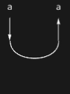

## Usage

<code>[CapDiagram](https://resources.wolframcloud.com/PacletRepository/resources/Wolfram/DiagrammaticComputation/ref/CapDiagram)[$p$]</code> creates a diagram connecting two input ports $p$ and <code>[PortDual](https://resources.wolframcloud.com/PacletRepository/resources/Wolfram/DiagrammaticComputation/ref/PortDual)[$p$]</code> with a cap.

<code>[CapDiagram](https://resources.wolframcloud.com/PacletRepository/resources/Wolfram/DiagrammaticComputation/ref/CapDiagram)[$p$, $q$]</code> connects two specified input ports.

## Details & Options

- A cap has two inputs and no outputs; it is the *counit* / evaluation morphism that pairs a port with its dual.
- Together with <code>[CupDiagram](https://resources.wolframcloud.com/PacletRepository/resources/Wolfram/DiagrammaticComputation/ref/CupDiagram)</code> it provides the snake-equation duals that make the category compact-closed.

## Basic Examples

A basic cap:

```wl
CapDiagram[a]
```



## Properties and Relations

The dual of <code>[CapDiagram](https://resources.wolframcloud.com/PacletRepository/resources/Wolfram/DiagrammaticComputation/ref/CapDiagram)</code> is <code>[CupDiagram](https://resources.wolframcloud.com/PacletRepository/resources/Wolfram/DiagrammaticComputation/ref/CupDiagram)</code>. Composing a cap with a cup on the same wire produces the identity (the snake equation).
