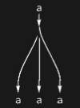

## Usage

<code>[CopyDiagram](https://resources.wolframcloud.com/PacletRepository/resources/Wolfram/DiagrammaticComputation/ref/CopyDiagram)[$p$, $n$]</code> creates a diagram with one input port $p$ and $n$ output copies of $p$.

<code>[CopyDiagram](https://resources.wolframcloud.com/PacletRepository/resources/Wolfram/DiagrammaticComputation/ref/CopyDiagram)[$p$, {$q_1$, …, $q_n$}]</code> copies $p$ onto the explicit output ports $q_1, …, q_n$.

## Details & Options

- A copy diagram is a special case of <code>[SpiderDiagram](https://resources.wolframcloud.com/PacletRepository/resources/Wolfram/DiagrammaticComputation/ref/SpiderDiagram)</code> with one input and many outputs.
- It is the comultiplication morphism of a Frobenius / classical-structure on its wire.

## Basic Examples

A 1-to-3 copy:

```wl
CopyDiagram[a, 3]
```



## Properties and Relations

The dual operation is <code>[MergeDiagram](https://resources.wolframcloud.com/PacletRepository/resources/Wolfram/DiagrammaticComputation/ref/MergeDiagram)</code>. Copy and merge satisfy the (co)associativity and (co)commutativity laws of a commutative Frobenius algebra.
