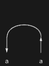

## Usage

<code>[CupDiagram](https://resources.wolframcloud.com/PacletRepository/resources/Wolfram/DiagrammaticComputation/ref/CupDiagram)[$p$]</code> creates a diagram connecting two output ports $p$ and <code>[PortDual](https://resources.wolframcloud.com/PacletRepository/resources/Wolfram/DiagrammaticComputation/ref/PortDual)[$p$]</code> with a cup.

<code>[CupDiagram](https://resources.wolframcloud.com/PacletRepository/resources/Wolfram/DiagrammaticComputation/ref/CupDiagram)[$p$, $q$]</code> connects two specified output ports.

## Details & Options

- A cup has no inputs and two outputs; it is the *unit* / coevaluation morphism that "creates a pair" of a port and its dual.
- Together with <code>[CapDiagram](https://resources.wolframcloud.com/PacletRepository/resources/Wolfram/DiagrammaticComputation/ref/CapDiagram)</code> it gives the snake equations of a compact-closed category.

## Basic Examples

A basic cup:

```wl
CupDiagram[a]
```



## Properties and Relations

The dual of <code>[CupDiagram](https://resources.wolframcloud.com/PacletRepository/resources/Wolfram/DiagrammaticComputation/ref/CupDiagram)</code> is <code>[CapDiagram](https://resources.wolframcloud.com/PacletRepository/resources/Wolfram/DiagrammaticComputation/ref/CapDiagram)</code>.
