## Usage

<code>[Diagram](https://resources.wolframcloud.com/PacletRepository/resources/Wolfram/DiagrammaticComputation/ref/Diagram)[$data$]</code> represents a diagram carrying the data $data$, with no input or output ports.

<code>[Diagram](https://resources.wolframcloud.com/PacletRepository/resources/Wolfram/DiagrammaticComputation/ref/Diagram)[$data$, {$o_1$, $o_2$, …}]</code> specifies the output ports $o_1, o_2, …$.

<code>[Diagram](https://resources.wolframcloud.com/PacletRepository/resources/Wolfram/DiagrammaticComputation/ref/Diagram)[$data$, {$i_1$, …}, {$o_1$, …}]</code> specifies the input ports $i_1, …$ and output ports $o_1, …$.

## Details & Options

- <code>[Diagram](https://resources.wolframcloud.com/PacletRepository/resources/Wolfram/DiagrammaticComputation/ref/Diagram)</code> objects can represent a single process with inputs and outputs as well as arbitrary compositions of such diagrams.
- <code>[Diagram](https://resources.wolframcloud.com/PacletRepository/resources/Wolfram/DiagrammaticComputation/ref/Diagram)["A", …]</code> displays in a notebook as a box containing the data <code>"A"</code>:

```wl
Diagram["A", {a, b}, {c, d, e}]
```

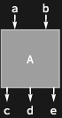

- The $data$ argument can be any of the following:

| Form | Meaning |
|---|---|
| <code>$d_1$ \[CircleTimes] $d_2$ \[CircleTimes] …</code> or <code>[DiagramProduct]()[…]</code> | product of subdiagrams |
| <code>$d_1$ \[CirclePlus] $d_2$ \[CirclePlus] …</code> or <code>[DiagramSum]()[…]</code> | sum of subdiagrams |
| <code>$d_1$ \[CircleDot] $d_2$ \[CircleDot] …</code> or <code>[DiagramComposition]()[…]</code> | sequential composition |
| <code>$d_1$ @\* $d_2$ @\* …</code> or <code>[DiagramComposition]()[…]</code> | sequential composition (left-to-right execution) |
| <code>$d_1$ /\* $d_2$ /\* …</code> or <code>[DiagramRightComposition]()[…]</code> | sequential composition (right-to-left execution) |
| <code>{$d_1$, $d_2$, …}</code> or <code>[DiagramNetwork]()[…]</code> | network of subdiagrams |
| <code>$d^*$</code> or <code>[DiagramDual]()[$d$]</code> | dual diagram |
| <code>[Overscript]()[$d$, _]</code> or <code>[DiagramFlip]()[$d$]</code> | flipped diagram |
| <code>[Overscript]()[$d$, ~]</code> or <code>[DiagramReverse]()[$d$]</code> | reversed diagram |
| any other $expr$ | singleton diagram |

- <code>[Diagram](https://resources.wolframcloud.com/PacletRepository/resources/Wolfram/DiagrammaticComputation/ref/Diagram)[$data$]</code> is equivalent to <code>[Diagram](https://resources.wolframcloud.com/PacletRepository/resources/Wolfram/DiagrammaticComputation/ref/Diagram)[$data$, {}, {}]</code>.
- <code>[Diagram](https://resources.wolframcloud.com/PacletRepository/resources/Wolfram/DiagrammaticComputation/ref/Diagram)[$data$, {$o_1$, …}]</code> is equivalent to <code>[Diagram](https://resources.wolframcloud.com/PacletRepository/resources/Wolfram/DiagrammaticComputation/ref/Diagram)[$data$, {}, {$o_1$, …}]</code>.
- The following special wrappers can be used on individual ports:

| Wrapper | Meaning |
|---|---|
| <code>[Labeled]()[$p$, …]</code> | display the port with a labelling |
| <code>[Style]()[$p$, …]</code> | render the port with the specified styles |

- A <code>[Diagram](https://resources.wolframcloud.com/PacletRepository/resources/Wolfram/DiagrammaticComputation/ref/Diagram)</code> carries a large list of options that control its visual appearance. The most-used groups are:

| Group | Options |
|---|---|
| Geometry | <code>"Angle"</code>, <code>"Center"</code>, <code>"Height"</code>, <code>"Width"</code>, <code>"Shape"</code>, <code>"Rotate"</code> |
| Layout | <code>"Arrange"</code>, <code>"AssignPorts"</code>, <code>"Direction"</code>, <code>"Grid"</code>, <code>"Network"</code>, <code>"NetworkMethod"</code>, <code>"Orientation"</code>, <code>"HorizontalGapSize"</code>, <code>"VerticalGapSize"</code>, <code>"Spacing"</code> |
| Decomposition | <code>"Decompose"</code>, <code>"Diagram"</code>, <code>"Ports"</code>, <code>"Unary"</code>, <code>"Simplify"</code>, <code>"UnarySpiders"</code>, <code>"BinarySpiders"</code>, <code>"SpiderRadius"</code>, <code>"RemoveCycles"</code> |
| Ports & wires | <code>"PortArrows"</code>, <code>"PortLabels"</code>, <code>"PortArrowFunction"</code>, <code>"PortLabelFunction"</code>, <code>"PortFunction"</code>, <code>"PortOrderingFunction"</code>, <code>"WireArrows"</code>, <code>"WireLabels"</code>, <code>"WireLabelFunction"</code>, <code>"Wires"</code> |
| Display | <code>"Background"</code>, <code>"Frames"</code>, <code>"LabelFunction"</code>, <code>"ShowLabel"</code>, <code>"ShowPortLabels"</code>, <code>"ShowWireLabels"</code>, <code>"Outline"</code>, <code>"Scale"</code>, <code>"ArrowSize"</code> |

- The <code>"Shape"</code> option accepts any of the following:

| Value | Meaning |
|---|---|
| <code>[Automatic]()</code> / <code>"Rectangle"</code> / <code>"Square"</code> | filled rectangle (default) |
| <code>"RoundedRectangle"</code> | rectangle with one rounded corner |
| <code>"RoundRectangle"</code> | rectangle with all corners rounded |
| <code>"Triangle"</code> / <code>"UpsideDownTriangle"</code> | triangle pointing up / down |
| <code>"RoundedTriangle"</code> / <code>"RoundedUpsideDownTriangle"</code> | triangle with rounded corners |
| <code>"Circle"</code> | circle outline |
| <code>"Disk"</code> | filled disk |
| <code>"Bracket"</code> / <code>"UpsideDownBracket"</code> | U-shaped bracket opening up / down |
| <code>"Croissant"</code> / <code>"UpsideDownCroissant"</code> | crescent-style filled curve |
| <code>"Wires"</code> | bezier wires connecting matching input / output ports |
| <code>"Wires"[{{$i_1$, $o_1$}, …}]</code> | bezier wires between the specified port-index pairs |
| <code>"Wire"</code> | single wire bundle through the centre |
| <code>"CrossWires"</code> | crossing bezier wires for permutation diagrams |
| <code>"Point"</code> | a single point (spider / junction) |
| <code>[None]()</code> | render no shape (label only) |
| <code>$f$_Function</code> | call $f[d]$ on the diagram to produce graphics |
| any graphics primitive | use the primitive directly (translated to the diagram centre) |

## Basic Examples

Create a diagram with two input and three output ports:

```wl
Diagram["A", {a, b}, {c, d, e}]
```


Horizontally compose diagrams using <code>[CircleTimes](https://reference.wolfram.com/language/ref/CircleTimes.html)</code>:

```wl
Diagram[Diagram["A", a, b] \[CircleTimes] Diagram["B", c, d]]
```

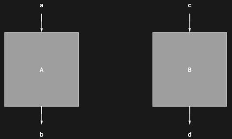

Vertically compose diagrams using <code>[CircleDot](https://reference.wolfram.com/language/ref/CircleDot.html)</code>:

```wl
Diagram[Diagram["A", b, a] \[CircleDot] Diagram["B", c, b]]
```

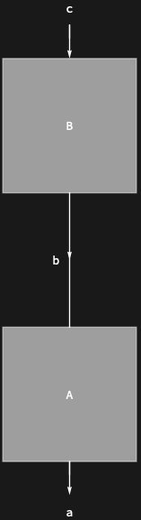

Invert port arrows with <code>[SuperStar](https://reference.wolfram.com/language/ref/SuperStar.html)</code>:

```wl
Diagram[SuperStar[Diagram["A", {a, b, c}, {d, e}]]]
```

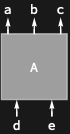

## Scope

The data argument can be any expression:

```wl
Diagram[Unevaluated[1 + 2], 3]
```

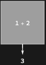

A diagram can be converted to a symbolic tensor:

```wl
diagram = Diagram[Diagram["A", a, b] \[CircleTimes] Diagram["C", d, e] \[CircleDot] Diagram["B", c, d]];
DiagramTensor[diagram]
```

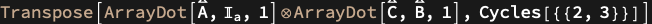

## Options

### "Shape"

Change the shape of a diagram to one of the built-in forms:

```wl
Diagram["A", a, {b, c, d}, "Shape" -> "Triangle"]
```

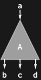

```wl
Diagram["A", {b, c, d}, a, "Shape" -> "Circle"]
```

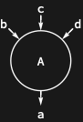

Use custom graphics for a shape:

```wl
Diagram["A", a, b, "Shape" -> {Opacity[.5, Cyan], Disk[{0, 0}, 1/2]}]
```

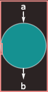

### "Angle"

Change the default angle of a diagram:

```wl
Diagram["A", a, {b, c}, "Angle" -> Pi/4]
```

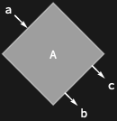

### "Height"

Change the default height of a diagram:

```wl
Diagram["A", a, b, "Height" -> 2]
```

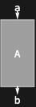

### "Width"

Change the default width of a diagram:

```wl
Diagram["A", a, b, "Width" -> 2]
```

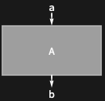

### "PortArrows"

Customise port arrows. Pass <code>[None](https://reference.wolfram.com/language/ref/None.html)</code> to hide them, <code>{$in$, $out$}</code> to control inputs and outputs separately, or a nested list for per-port control:

```wl
Diagram["A", {a, b}, {c, d}, "PortArrows" -> None]
```

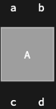

```wl
Diagram["A", {a, b}, {c, d}, "PortArrows" -> {Red, Automatic}]
```

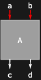

```wl
Diagram["A", {a, b}, {c, d}, "PortArrows" -> {{False, True}, {True, False}}]
```

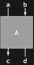

### "PortLabels"

Customise port labels:

```wl
Diagram["A", {a, b}, {c, d}, "PortLabels" -> None]
```

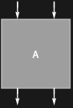

```wl
Diagram["A", {a, b}, {c, d}, "PortLabels" -> {{"AAA", Automatic}, {None, "DDD"}}]
```

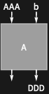

## Properties and Relations

<code>[Diagram](https://resources.wolframcloud.com/PacletRepository/resources/Wolfram/DiagrammaticComputation/ref/Diagram)</code> is the central object of the paclet. <code>[Port](https://resources.wolframcloud.com/PacletRepository/resources/Wolfram/DiagrammaticComputation/ref/Port)</code> carries the endpoints, <code>[DiagramProduct](https://resources.wolframcloud.com/PacletRepository/resources/Wolfram/DiagrammaticComputation/ref/DiagramProduct)</code> / <code>[DiagramComposition](https://resources.wolframcloud.com/PacletRepository/resources/Wolfram/DiagrammaticComputation/ref/DiagramComposition)</code> / <code>[DiagramSum](https://resources.wolframcloud.com/PacletRepository/resources/Wolfram/DiagrammaticComputation/ref/DiagramSum)</code> / <code>[DiagramNetwork](https://resources.wolframcloud.com/PacletRepository/resources/Wolfram/DiagrammaticComputation/ref/DiagramNetwork)</code> build composites, <code>[DiagramGraphics](https://resources.wolframcloud.com/PacletRepository/resources/Wolfram/DiagrammaticComputation/ref/DiagramGraphics)</code> and <code>[DiagramGrid](https://resources.wolframcloud.com/PacletRepository/resources/Wolfram/DiagrammaticComputation/ref/DiagramGrid)</code> render them, and <code>[DiagramTensor](https://resources.wolframcloud.com/PacletRepository/resources/Wolfram/DiagrammaticComputation/ref/DiagramTensor)</code> / <code>[DiagramFunction](https://resources.wolframcloud.com/PacletRepository/resources/Wolfram/DiagrammaticComputation/ref/DiagramFunction)</code> export them back to Wolfram Language expressions.
