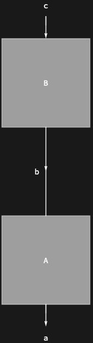

## Usage

<code>[DiagramComposition](https://resources.wolframcloud.com/PacletRepository/resources/Wolfram/DiagrammaticComputation/ref/DiagramComposition)[$d_1$, $d_2$, $d_3$, …]</code> represents the sequential composition of the diagrams $d_i$.

## Details & Options

- Reads right-to-left, matching the convention for function composition: in <code>[DiagramComposition](https://resources.wolframcloud.com/PacletRepository/resources/Wolfram/DiagrammaticComputation/ref/DiagramComposition)[$d_1$, $d_2$]</code>, $d_2$ runs first and $d_1$ runs second.
- The output ports of $d_{i+1}$ must match the input ports of $d_i$ pairwise. The resulting diagram has the inputs of the rightmost diagram and the outputs of the leftmost.
- The shorthand <code>$d_1$ @* $d_2$</code> produces a <code>[DiagramComposition](https://resources.wolframcloud.com/PacletRepository/resources/Wolfram/DiagrammaticComputation/ref/DiagramComposition)</code>, matching <code>[Composition](https://reference.wolfram.com/language/ref/Composition.html)</code>. The left-to-right reading is available as <code>[DiagramRightComposition](https://resources.wolframcloud.com/PacletRepository/resources/Wolfram/DiagrammaticComputation/ref/DiagramRightComposition)</code> and the <code>/*</code> operator.
- The identity for <code>[DiagramComposition](https://resources.wolframcloud.com/PacletRepository/resources/Wolfram/DiagrammaticComputation/ref/DiagramComposition)</code> is <code>[IdentityDiagram](https://resources.wolframcloud.com/PacletRepository/resources/Wolfram/DiagrammaticComputation/ref/IdentityDiagram)</code> on the matching port.

## Basic Examples

Compose two diagrams in sequence:

```wl
DiagramComposition[Diagram["A", b, a], Diagram["B", c, b]]
```


Use the <code>@*</code> shorthand:

```wl
Diagram[Diagram["A", b, a] @* Diagram["B", c, b]]
```


Read left-to-right with <code>/*</code>:

```wl
Diagram[Diagram["B", c, b] /* Diagram["A", b, a]]
```



## Properties and Relations

<code>[DiagramComposition](https://resources.wolframcloud.com/PacletRepository/resources/Wolfram/DiagrammaticComputation/ref/DiagramComposition)</code> is the sequential analogue of <code>[DiagramProduct](https://resources.wolframcloud.com/PacletRepository/resources/Wolfram/DiagrammaticComputation/ref/DiagramProduct)</code> (parallel) and <code>[DiagramSum](https://resources.wolframcloud.com/PacletRepository/resources/Wolfram/DiagrammaticComputation/ref/DiagramSum)</code> (additive). All three are subsumed by <code>[DiagramNetwork](https://resources.wolframcloud.com/PacletRepository/resources/Wolfram/DiagrammaticComputation/ref/DiagramNetwork)</code>, which composes by port name rather than position.

The tensor-level analogue is <code>[Dot](https://reference.wolfram.com/language/ref/Dot.html)</code> / <code>[TensorContract](https://reference.wolfram.com/language/ref/TensorContract.html)</code>.
