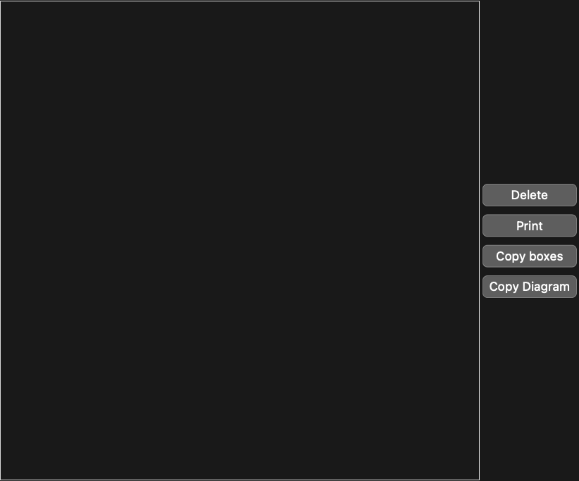

## Usage

<code>[DiagramDraw](https://resources.wolframcloud.com/PacletRepository/resources/Wolfram/DiagrammaticComputation/ref/DiagramDraw)[]</code> opens an interactive canvas for sketching a diagram and returns the constructed <code>[Diagram](https://resources.wolframcloud.com/PacletRepository/resources/Wolfram/DiagrammaticComputation/ref/Diagram)</code> expression.

<code>[DiagramDraw](https://resources.wolframcloud.com/PacletRepository/resources/Wolfram/DiagrammaticComputation/ref/DiagramDraw)[$d$]</code> opens the canvas seeded with the existing diagram $d$.

## Details & Options

- Boxes, ports and wires are placed by hand on the canvas. The resulting diagram can be copied back into a notebook and used like any other <code>[Diagram](https://resources.wolframcloud.com/PacletRepository/resources/Wolfram/DiagrammaticComputation/ref/Diagram)</code>.
- Useful for sketching small examples and exporting them as symbolic diagrams. For programmatic construction, use the <code>[Diagram](https://resources.wolframcloud.com/PacletRepository/resources/Wolfram/DiagrammaticComputation/ref/Diagram)</code> family directly.

## Basic Examples

Open the drawing canvas:

```wl
DiagramDraw[]
```



The canvas returns a constructed <code>[Diagram](https://resources.wolframcloud.com/PacletRepository/resources/Wolfram/DiagrammaticComputation/ref/Diagram)</code> expression once drawing is complete.
