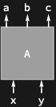

## Usage

<code>[DiagramDual](https://resources.wolframcloud.com/PacletRepository/resources/Wolfram/DiagrammaticComputation/ref/DiagramDual)[$d$]</code> changes the direction of every port of the diagram $d$ — outputs become inputs and vice versa, with each port dualised.

## Details & Options

- <code>[DiagramDual](https://resources.wolframcloud.com/PacletRepository/resources/Wolfram/DiagrammaticComputation/ref/DiagramDual)</code> is an involution: <code>[DiagramDual](https://resources.wolframcloud.com/PacletRepository/resources/Wolfram/DiagrammaticComputation/ref/DiagramDual)[[DiagramDual]()[$d$]] == $d$</code>.
- It is *port-wise* duality: each port is replaced by its <code>[PortDual](https://resources.wolframcloud.com/PacletRepository/resources/Wolfram/DiagrammaticComputation/ref/PortDual)</code>, and the input/output lists are swapped.
- The shorthand <code>$d^*$</code> produces a <code>[DiagramDual](https://resources.wolframcloud.com/PacletRepository/resources/Wolfram/DiagrammaticComputation/ref/DiagramDual)</code>.

## Basic Examples

Reverse the direction of all ports of a diagram:

```wl
DiagramDual[Diagram["A", {a, b, c}, {x, y}]]
```



## Properties and Relations

<code>[DiagramDual](https://resources.wolframcloud.com/PacletRepository/resources/Wolfram/DiagrammaticComputation/ref/DiagramDual)</code> is one of three involutions on diagrams: <code>[DiagramFlip](https://resources.wolframcloud.com/PacletRepository/resources/Wolfram/DiagrammaticComputation/ref/DiagramFlip)</code> swaps inputs and outputs without dualising ports, and <code>[DiagramReverse](https://resources.wolframcloud.com/PacletRepository/resources/Wolfram/DiagrammaticComputation/ref/DiagramReverse)</code> reverses the *order* of the ports without changing their direction.
