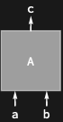
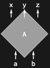

## Usage

<code>[DiagramFlip](https://resources.wolframcloud.com/PacletRepository/resources/Wolfram/DiagrammaticComputation/ref/DiagramFlip)[$d$]</code> reflects the diagram $d$ vertically — swaps its inputs and outputs without dualising ports.

## Details & Options

- <code>[DiagramFlip](https://resources.wolframcloud.com/PacletRepository/resources/Wolfram/DiagrammaticComputation/ref/DiagramFlip)</code> is an involution.
- The shape of the diagram is reflected top-to-bottom; the data is preserved.

## Basic Examples

Flip the inputs and outputs of a diagram:

```wl
DiagramFlip[Diagram["A", {a, b}, {c}]]
```



## Scope

A flipped diagram inherits the parent's shape and is rendered upside down:

```wl
DiagramFlip[Diagram["A", {a, b}, {x, y, z}, "Angle" -> Pi/4]]
```



## Properties and Relations

<code>[DiagramFlip](https://resources.wolframcloud.com/PacletRepository/resources/Wolfram/DiagrammaticComputation/ref/DiagramFlip)</code> is the transpose: it swaps inputs and outputs while preserving port direction. Compare with <code>[DiagramDual](https://resources.wolframcloud.com/PacletRepository/resources/Wolfram/DiagrammaticComputation/ref/DiagramDual)</code> (dualises ports as well) and <code>[DiagramReverse](https://resources.wolframcloud.com/PacletRepository/resources/Wolfram/DiagrammaticComputation/ref/DiagramReverse)</code> (reverses port order).
