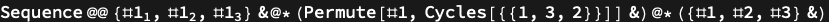

## Usage

<code>[DiagramFunction](https://resources.wolframcloud.com/PacletRepository/resources/Wolfram/DiagrammaticComputation/ref/DiagramFunction)[$d$]</code> returns a pure function whose input/output signature matches the ports of the diagram $d$.

## Details & Options

- The function reads input arguments as the input ports of the diagram, threads them through each subdiagram according to its composition, and returns a tuple of values for the output ports.
- Useful for executing a symbolic diagram as code; complementary to <code>[DiagramTensor](https://resources.wolframcloud.com/PacletRepository/resources/Wolfram/DiagrammaticComputation/ref/DiagramTensor)</code>, which executes the diagram as a tensor contraction.

## Basic Examples

Convert a permutation diagram to its function:

```wl
DiagramFunction @ PermutationDiagram[{a, c, b} -> {c, b, a}]
```


