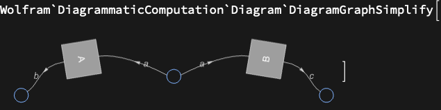

## Usage

<code>[DiagramGraphSimplify](https://resources.wolframcloud.com/PacletRepository/resources/Wolfram/DiagrammaticComputation/ref/DiagramGraphSimplify)[$d$]</code> simplifies the underlying port graph of the diagram $d$ by contracting redundant wires and merging spiders.

## Details & Options

- Operates on the graph view of a diagram (see <code>[DiagramsPortGraph](https://resources.wolframcloud.com/PacletRepository/resources/Wolfram/DiagrammaticComputation/ref/DiagramsPortGraph)</code>) rather than its expression structure. Use after <code>[ToDiagramNetwork](https://resources.wolframcloud.com/PacletRepository/resources/Wolfram/DiagrammaticComputation/ref/ToDiagramNetwork)</code> to clean up redundant connections.
- The expression-level analogue is <code>[SimplifyDiagram](https://resources.wolframcloud.com/PacletRepository/resources/Wolfram/DiagrammaticComputation/ref/SimplifyDiagram)</code>.

## Basic Examples

Simplify the port graph of a network:

```wl
DiagramGraphSimplify[DiagramNetwork[Diagram["A", a, b], Diagram["B", a, c]]]
```


