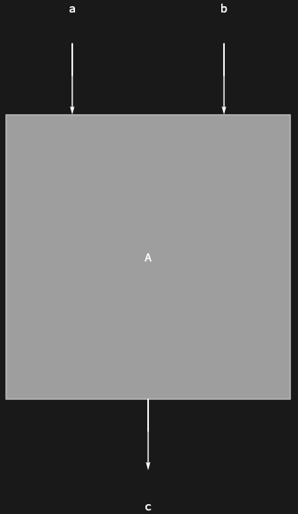
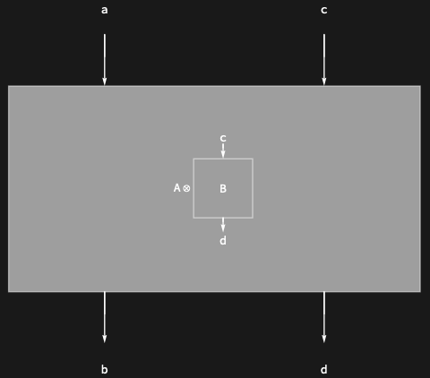

## Usage

<code>[DiagramGraphics](https://resources.wolframcloud.com/PacletRepository/resources/Wolfram/DiagrammaticComputation/ref/DiagramGraphics)[$d$]</code> returns a graphical representation of the diagram $d$ as a single labelled node with attached input and output ports.

## Details & Options

- Used by <code>[Diagram](https://resources.wolframcloud.com/PacletRepository/resources/Wolfram/DiagrammaticComputation/ref/Diagram)</code> itself to render an opaque diagram. Unlike <code>[DiagramGrid](https://resources.wolframcloud.com/PacletRepository/resources/Wolfram/DiagrammaticComputation/ref/DiagramGrid)</code>, it does *not* decompose composite diagrams into a grid of subdiagrams — the whole diagram is shown as one box.
- Accepts the same shape-, port-, and label-related options as <code>[Diagram](https://resources.wolframcloud.com/PacletRepository/resources/Wolfram/DiagrammaticComputation/ref/Diagram)</code>.

## Basic Examples

Show single-node graphics for a <code>[Diagram](https://resources.wolframcloud.com/PacletRepository/resources/Wolfram/DiagrammaticComputation/ref/Diagram)</code>:

```wl
DiagramGraphics[Diagram["A", {a, b}, c]]
```



A composite diagram is also rendered as a single node:

```wl
DiagramGraphics[DiagramProduct[Diagram["A", a, b], Diagram["B", c, d]]]
```



## Properties and Relations

<code>[DiagramGraphics](https://resources.wolframcloud.com/PacletRepository/resources/Wolfram/DiagrammaticComputation/ref/DiagramGraphics)</code> is the *node* view; <code>[DiagramGrid](https://resources.wolframcloud.com/PacletRepository/resources/Wolfram/DiagrammaticComputation/ref/DiagramGrid)</code> is the *decomposed* view that lays subdiagrams out in a 2D grid.
