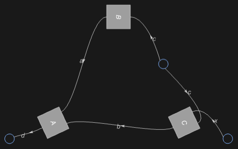
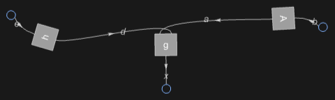
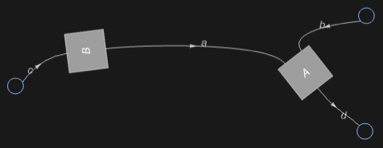
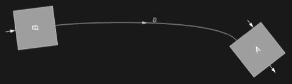

## Usage

<code>[DiagramNetwork](https://resources.wolframcloud.com/PacletRepository/resources/Wolfram/DiagrammaticComputation/ref/DiagramNetwork)[$d_1$, $d_2$, …]</code> composes the diagrams $d_i$ as an orderless network, joining ports of equal name.

## Details & Options

- Network composition matches ports by name rather than by position. Two diagrams sharing a port name are wired through that port; unmatched ports become inputs / outputs of the resulting diagram.
- This is the diagram analogue of tensor-network contraction.
- A network is automatically converted to a grid layout when displayed; the conversion can be controlled by the network options below.
- The following options can be given:

| Option | Default | Description |
|---|---|---|
| <code>"BinarySpiders"</code> | <code>[True]()</code> | merge binary (degree-2) wire junctions into spiders |
| <code>"UnarySpiders"</code> | <code>[True]()</code> | merge unary (degree-1) wire endpoints into spiders |
| <code>"Arrange"</code> | <code>[True]()</code> | automatically arrange the network into a grid for display |
| <code>"NetworkMethod"</code> | <code>"GridFoliation"</code> | method for converting a network to a grid layout |

## Basic Examples

Compose diagrams into a network:

```wl
DiagramNetwork[
  Diagram[A, {a, b}, d],
  Diagram[B, c, a],
  Diagram[C, {x, c}, b]
]
```



Turn a grid diagram into a network:

```wl
diagram = DiagramComposition[Diagram["g", {a, d}, x], Diagram["A", b, a], Diagram["h", e, d]];
diagram["Network"]
```



## Options

### "BinarySpiders"

Without binary spiders, degree-2 junctions are kept as ordinary wires:

```wl
DiagramNetwork[Diagram[A, {a, b}, d], Diagram[B, c, a], "BinarySpiders" -> False]
```



### "UnarySpiders"

Without unary spiders, dangling wires are kept as free ports rather than terminated nodes:

```wl
DiagramNetwork[Diagram[A, {a, b}, d], Diagram[B, c, a], "UnarySpiders" -> False]
```



## Properties and Relations

<code>[DiagramNetwork](https://resources.wolframcloud.com/PacletRepository/resources/Wolfram/DiagrammaticComputation/ref/DiagramNetwork)</code> generalises <code>[DiagramProduct](https://resources.wolframcloud.com/PacletRepository/resources/Wolfram/DiagrammaticComputation/ref/DiagramProduct)</code> and <code>[DiagramComposition](https://resources.wolframcloud.com/PacletRepository/resources/Wolfram/DiagrammaticComputation/ref/DiagramComposition)</code>: those two arise as special cases where ports match by position. The reverse direction is <code>[ToDiagramNetwork](https://resources.wolframcloud.com/PacletRepository/resources/Wolfram/DiagrammaticComputation/ref/ToDiagramNetwork)</code>, which re-expresses an arbitrary composite diagram in network form.
