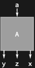

## Usage

<code>[DiagramPermute](https://resources.wolframcloud.com/PacletRepository/resources/Wolfram/DiagrammaticComputation/ref/DiagramPermute)[$d$, $perm$]</code> permutes the ports of the diagram $d$ by the permutation $perm$.

<code>[DiagramPermute](https://resources.wolframcloud.com/PacletRepository/resources/Wolfram/DiagrammaticComputation/ref/DiagramPermute)[$d$, $inPerm$, $outPerm$]</code> permutes the input and output ports independently.

## Details & Options

- $perm$ may be a <code>[Cycles](https://reference.wolfram.com/language/ref/Cycles.html)</code> object, a permutation list, or any input accepted by <code>[Permute](https://reference.wolfram.com/language/ref/Permute.html)</code>.
- <code>[DiagramReverse](https://resources.wolframcloud.com/PacletRepository/resources/Wolfram/DiagrammaticComputation/ref/DiagramReverse)</code> is the special case of permuting by the reverse-order permutation.

## Basic Examples

Reorder a diagram's outputs:

```wl
DiagramPermute[Diagram["A", a, {x, y, z}], Cycles[{{1, 2, 3}}]]
```


