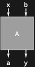

## Usage

<code>[DiagramPermute](https://resources.wolframcloud.com/PacletRepository/resources/Wolfram/DiagrammaticComputation/ref/DiagramPermute)[$d$, $perm$]</code> permutes the ports of the diagram $d$ by the permutation $perm$.

<code>[DiagramPermute](https://resources.wolframcloud.com/PacletRepository/resources/Wolfram/DiagrammaticComputation/ref/DiagramPermute)[$d$, $perm$, $dualQ$]</code> controls whether ports moved across the input/output boundary are dualised.

## Details & Options

- $perm$ is a <code>[Cycles](https://reference.wolfram.com/language/ref/Cycles.html)</code> object (or anything <code>[Permute](https://reference.wolfram.com/language/ref/Permute.html)</code> accepts) acting on the flattened port list — output ports first, then input ports.
- A permutation within the outputs composes a <code>[PermutationDiagram](https://resources.wolframcloud.com/PacletRepository/resources/Wolfram/DiagrammaticComputation/ref/PermutationDiagram)</code> after $d$; one within the inputs composes it before; a permutation crossing the boundary additionally bends wires like <code>[DiagramSplit](https://resources.wolframcloud.com/PacletRepository/resources/Wolfram/DiagrammaticComputation/ref/DiagramSplit)</code>.
- For a singleton tensor-annotated diagram, the permutation is recorded as a <code>[Transpose](https://reference.wolfram.com/language/ref/Transpose.html)</code> of the underlying tensor.

## Basic Examples

Swap the two output ports of a process:

```wl
DiagramPermute[Diagram[A, {a, b}, {x, y}], Cycles[{{1, 2}}]]
```


Permute ports across the input/output boundary:

```wl
DiagramPermute[Diagram[A, {a, b}, {x, y}], Cycles[{{1, 3}}]]
```



## Properties and Relations

<code>[DiagramReverse](https://resources.wolframcloud.com/PacletRepository/resources/Wolfram/DiagrammaticComputation/ref/DiagramReverse)</code> is the special case of reversing the port order; <code>[DiagramSplit](https://resources.wolframcloud.com/PacletRepository/resources/Wolfram/DiagrammaticComputation/ref/DiagramSplit)</code> moves the input/output boundary without reordering.
