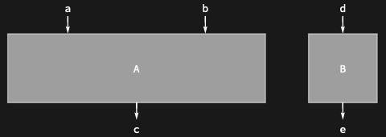
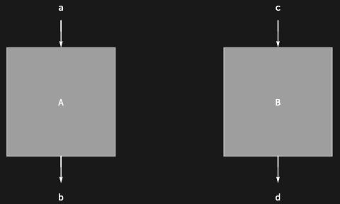

## Usage

<code>[DiagramProduct](https://resources.wolframcloud.com/PacletRepository/resources/Wolfram/DiagrammaticComputation/ref/DiagramProduct)[$d_1$, $d_2$, $d_3$, …]</code> represents the parallel (tensor) composition of the diagrams $d_i$.

## Details & Options

- The product diagram has as inputs the <code>[PortProduct](https://resources.wolframcloud.com/PacletRepository/resources/Wolfram/DiagrammaticComputation/ref/PortProduct)</code> of the inputs of the $d_i$ in order, and as outputs the <code>[PortProduct](https://resources.wolframcloud.com/PacletRepository/resources/Wolfram/DiagrammaticComputation/ref/PortProduct)</code> of the outputs in order.
- The infix shorthand <code>$d_1$ \[CircleTimes] $d_2$</code> evaluated inside <code>[Diagram](https://resources.wolframcloud.com/PacletRepository/resources/Wolfram/DiagrammaticComputation/ref/Diagram)</code> produces a <code>[DiagramProduct](https://resources.wolframcloud.com/PacletRepository/resources/Wolfram/DiagrammaticComputation/ref/DiagramProduct)</code>.
- The product is associative; the unit is <code>[EmptyDiagram](https://resources.wolframcloud.com/PacletRepository/resources/Wolfram/DiagrammaticComputation/ref/EmptyDiagram)</code>.

## Basic Examples

Compose diagrams in parallel:

```wl
DiagramProduct[Diagram["A", {a, b}, c], Diagram["B", d, e]]
```



Use <code>[CircleTimes](https://reference.wolfram.com/language/ref/CircleTimes.html)</code>:

```wl
Diagram[Diagram["A", a, b] \[CircleTimes] Diagram["B", c, d]]
```



## Properties and Relations

<code>[DiagramProduct](https://resources.wolframcloud.com/PacletRepository/resources/Wolfram/DiagrammaticComputation/ref/DiagramProduct)</code> is the parallel analogue of <code>[DiagramComposition](https://resources.wolframcloud.com/PacletRepository/resources/Wolfram/DiagrammaticComputation/ref/DiagramComposition)</code> (sequential). At the tensor level it corresponds to <code>[TensorProduct](https://reference.wolfram.com/language/ref/TensorProduct.html)</code> / <code>[KroneckerProduct](https://reference.wolfram.com/language/ref/KroneckerProduct.html)</code>. The layout-level analogue is <code>[RowDiagram](https://resources.wolframcloud.com/PacletRepository/resources/Wolfram/DiagrammaticComputation/ref/RowDiagram)</code>.
