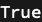
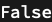

## Usage

<code>[DiagramQ](https://resources.wolframcloud.com/PacletRepository/resources/Wolfram/DiagrammaticComputation/ref/DiagramQ)[$expr$]</code> gives <code>[True](https://reference.wolfram.com/language/ref/True.html)</code> if $expr$ is a valid <code>[Diagram](https://resources.wolframcloud.com/PacletRepository/resources/Wolfram/DiagrammaticComputation/ref/Diagram)</code> and <code>[False](https://reference.wolfram.com/language/ref/False.html)</code> otherwise.

## Details & Options

- <code>[DiagramQ](https://resources.wolframcloud.com/PacletRepository/resources/Wolfram/DiagrammaticComputation/ref/DiagramQ)</code> checks structural validity, not just the head. Use it as a guard in patterns and option checks (e.g. <code>_? DiagramQ</code>).

## Basic Examples

A constructed diagram is valid:

```wl
DiagramQ[Diagram["A", a, b]]
```



Anything else is not:

```wl
DiagramQ[42]
```


