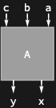

## Usage

<code>[DiagramReverse](https://resources.wolframcloud.com/PacletRepository/resources/Wolfram/DiagrammaticComputation/ref/DiagramReverse)[$d$]</code> reflects the diagram $d$ horizontally — reverses the order of its input ports and the order of its output ports.

## Details & Options

- <code>[DiagramReverse](https://resources.wolframcloud.com/PacletRepository/resources/Wolfram/DiagrammaticComputation/ref/DiagramReverse)</code> is an involution.
- It does not change port directions; only the ordering of inputs and outputs is reversed.

## Basic Examples

Reverse the port order of a diagram:

```wl
DiagramReverse[Diagram["A", {a, b, c}, {x, y}]]
```



## Properties and Relations

<code>[DiagramReverse](https://resources.wolframcloud.com/PacletRepository/resources/Wolfram/DiagrammaticComputation/ref/DiagramReverse)</code> is the horizontal counterpart of <code>[DiagramFlip](https://resources.wolframcloud.com/PacletRepository/resources/Wolfram/DiagrammaticComputation/ref/DiagramFlip)</code> (vertical). For more general re-orderings use <code>[DiagramPermute](https://resources.wolframcloud.com/PacletRepository/resources/Wolfram/DiagrammaticComputation/ref/DiagramPermute)</code>.
