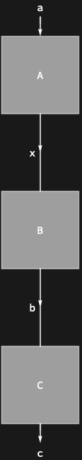

## Usage

<code>[DiagramRightComposition](https://resources.wolframcloud.com/PacletRepository/resources/Wolfram/DiagrammaticComputation/ref/DiagramRightComposition)[$d_1$, $d_2$, $d_3$, …]</code> represents the sequential composition of the diagrams $d_i$ read left-to-right — $d_1$ runs first, then $d_2$, then $d_3$, ….

## Details & Options

- This is the mirror of <code>[DiagramComposition](https://resources.wolframcloud.com/PacletRepository/resources/Wolfram/DiagrammaticComputation/ref/DiagramComposition)</code>: <code>[DiagramRightComposition](https://resources.wolframcloud.com/PacletRepository/resources/Wolfram/DiagrammaticComputation/ref/DiagramRightComposition)[$d_1$, …, $d_n$]</code> equals <code>[DiagramComposition](https://resources.wolframcloud.com/PacletRepository/resources/Wolfram/DiagrammaticComputation/ref/DiagramComposition)[$d_n$, …, $d_1$]</code>.
- The infix shorthand is <code>/*</code>, matching <code>[RightComposition](https://reference.wolfram.com/language/ref/RightComposition.html)</code>.
- Useful when reading a pipeline in execution order.

## Basic Examples

Pipeline three diagrams left-to-right:

```wl
Diagram[Diagram["A", a, x] /* Diagram["B", x, b] /* Diagram["C", b, c]]
```


