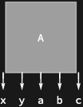
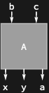
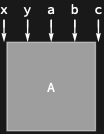

## Usage

<code>[DiagramSplit](https://resources.wolframcloud.com/PacletRepository/resources/Wolfram/DiagrammaticComputation/ref/DiagramSplit)[$d$, $n$]</code> repartitions the ports of $d$ so that its first $n$ ports become outputs and the remaining ones inputs.

<code>[DiagramSplit](https://resources.wolframcloud.com/PacletRepository/resources/Wolfram/DiagrammaticComputation/ref/DiagramSplit)[$d$]</code> turns every port into an output, making $d$ a state.

<code>[DiagramSplit](https://resources.wolframcloud.com/PacletRepository/resources/Wolfram/DiagrammaticComputation/ref/DiagramSplit)[$d$, $n$, $dualQ$]</code> controls whether the moved ports are dualised.

<code>[DiagramSplit](https://resources.wolframcloud.com/PacletRepository/resources/Wolfram/DiagrammaticComputation/ref/DiagramSplit)[$d$, $n$, $dualQ$, $flipQ$]</code> bends the moved wires around the other side.

## Details & Options

- Ports are counted in the flattened order: outputs first, then inputs. A negative $n$ counts back from the total arity, <code>-[Infinity](https://reference.wolfram.com/language/ref/Infinity.html)</code> makes every port an input, and the default <code>[Infinity](https://reference.wolfram.com/language/ref/Infinity.html)</code> makes every port an output.
- The repartitioning composes $d$ with a pure wire diagram that bends the moved ports around, so the underlying process is unchanged — this is the diagrammatic analogue of currying a function or transposing tensor legs between covariant and contravariant positions.
- With $dualQ$ set to <code>[False](https://reference.wolfram.com/language/ref/False.html)</code>, the moved ports keep their direction and are wrapped in <code>[PortDual](https://resources.wolframcloud.com/PacletRepository/resources/Wolfram/DiagrammaticComputation/ref/PortDual)</code> instead.
- With $flipQ$ set to <code>[True](https://reference.wolfram.com/language/ref/True.html)</code>, the bending wires pass on the opposite side of the retained ports.

## Basic Examples

Make all five ports of a process into outputs:

```wl
DiagramSplit[Diagram[A, {a, b, c}, {x, y}]]
```



Repartition to three outputs and two inputs:

```wl
DiagramSplit[Diagram[A, {a, b, c}, {x, y}], 3]
```



Turn the process into a costate, with every port an input:

```wl
DiagramSplit[Diagram[A, {a, b, c}, {x, y}], 0]
```



## Properties and Relations

Splitting at the existing output arity is the identity; <code>[DiagramSplit](https://resources.wolframcloud.com/PacletRepository/resources/Wolfram/DiagrammaticComputation/ref/DiagramSplit)[$d$, 0]</code> and <code>[DiagramSplit](https://resources.wolframcloud.com/PacletRepository/resources/Wolfram/DiagrammaticComputation/ref/DiagramSplit)[$d$]</code> realise the process–state correspondence built from <code>[CapDiagram](https://resources.wolframcloud.com/PacletRepository/resources/Wolfram/DiagrammaticComputation/ref/CapDiagram)</code> / <code>[CupDiagram](https://resources.wolframcloud.com/PacletRepository/resources/Wolfram/DiagrammaticComputation/ref/CupDiagram)</code> bends.
