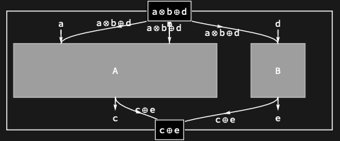

## Usage

<code>[DiagramSum](https://resources.wolframcloud.com/PacletRepository/resources/Wolfram/DiagrammaticComputation/ref/DiagramSum)[$d_1$, $d_2$, $d_3$, …]</code> represents the direct sum (additive choice) of the diagrams $d_i$.

## Details & Options

- The sum diagram has as inputs the <code>[PortSum](https://resources.wolframcloud.com/PacletRepository/resources/Wolfram/DiagrammaticComputation/ref/PortSum)</code> of the inputs of the $d_i$, and as outputs the <code>[PortSum](https://resources.wolframcloud.com/PacletRepository/resources/Wolfram/DiagrammaticComputation/ref/PortSum)</code> of the outputs. Categorically, this is the biproduct in additive monoidal categories.
- The infix shorthand <code>$d_1$ \[CirclePlus] $d_2$</code> evaluated inside <code>[Diagram](https://resources.wolframcloud.com/PacletRepository/resources/Wolfram/DiagrammaticComputation/ref/Diagram)</code> produces a <code>[DiagramSum](https://resources.wolframcloud.com/PacletRepository/resources/Wolfram/DiagrammaticComputation/ref/DiagramSum)</code>.
- The sum is associative; the unit is <code>[ZeroDiagram](https://resources.wolframcloud.com/PacletRepository/resources/Wolfram/DiagrammaticComputation/ref/ZeroDiagram)</code>.

## Basic Examples

Sum two diagrams:

```wl
DiagramSum[Diagram["A", {a, b}, c], Diagram["B", d, e]]
```



## Properties and Relations

<code>[DiagramSum](https://resources.wolframcloud.com/PacletRepository/resources/Wolfram/DiagrammaticComputation/ref/DiagramSum)</code> is the additive analogue of <code>[DiagramProduct](https://resources.wolframcloud.com/PacletRepository/resources/Wolfram/DiagrammaticComputation/ref/DiagramProduct)</code> (multiplicative). The closely-related logical reading is <code>[Alternatives](https://reference.wolfram.com/language/ref/Alternatives.html)</code> — a diagram representing "either".
