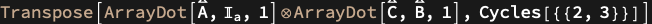
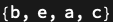

## Usage

<code>[DiagramTensor](https://resources.wolframcloud.com/PacletRepository/resources/Wolfram/DiagrammaticComputation/ref/DiagramTensor)[$d$]</code> returns a symbolic tensor expression representing the diagram $d$ as a tensor contraction.

## Details & Options

- Composition becomes <code>[ArrayDot](https://reference.wolfram.com/language/ref/ArrayDot.html)</code> / <code>[TensorContract](https://reference.wolfram.com/language/ref/TensorContract.html)</code> and product becomes <code>[TensorProduct](https://reference.wolfram.com/language/ref/TensorProduct.html)</code>. Singleton diagrams become symbolic arrays whose dimensions are taken from the diagram's port types.
- The result is an inactive tensor expression — wrap in <code>[Activate](https://reference.wolfram.com/language/ref/Activate.html)</code> to evaluate when the underlying tensors are concrete.
- Inverse direction: <code>[TensorDiagram](https://resources.wolframcloud.com/PacletRepository/resources/Wolfram/DiagrammaticComputation/ref/TensorDiagram)</code> lifts a tensor expression back to a diagram.

## Basic Examples

Express a composite diagram as a contracted tensor:

```wl
diagram = Diagram[Diagram["A", a, b] \[CircleTimes] Diagram["C", d, e] \[CircleDot] Diagram["B", c, d]];
DiagramTensor[diagram]
```



Inspect the dimensions of the result:

```wl
TensorDimensions[Activate @ DiagramTensor[diagram]]
```



## Properties and Relations

<code>[DiagramTensor](https://resources.wolframcloud.com/PacletRepository/resources/Wolfram/DiagrammaticComputation/ref/DiagramTensor)</code> and <code>[TensorDiagram](https://resources.wolframcloud.com/PacletRepository/resources/Wolfram/DiagrammaticComputation/ref/TensorDiagram)</code> are inverse: the round-trip restores the original diagram up to the underlying tensor network.
