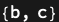

## Usage

<code>[DiagramsFreePorts](https://resources.wolframcloud.com/PacletRepository/resources/Wolfram/DiagrammaticComputation/ref/DiagramsFreePorts)[{$d_1$, $d_2$, …}]</code> returns the free ports of the diagrams $d_i$ — the ports whose expression occurs exactly once across all of them.

## Details & Options

- A port occurring twice (or more) is shared between subdiagrams and would be joined in a <code>[DiagramNetwork](https://resources.wolframcloud.com/PacletRepository/resources/Wolfram/DiagrammaticComputation/ref/DiagramNetwork)</code> of the $d_i$; the remaining single-occurrence ports are the network's boundary.
- The result is a list of held port expressions; input ports appear wrapped in <code>[PortDual](https://resources.wolframcloud.com/PacletRepository/resources/Wolfram/DiagrammaticComputation/ref/PortDual)</code>.

## Basic Examples

Two diagrams sharing the input port <code>a</code> have free ports <code>b</code> and <code>c</code>:

```wl
DiagramsFreePorts[{Diagram["A", a, b], Diagram["B", a, c]}]
```


