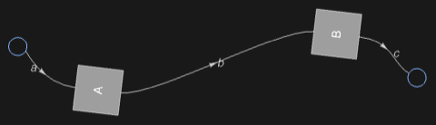

## Usage

<code>[DiagramsNetGraph](https://resources.wolframcloud.com/PacletRepository/resources/Wolfram/DiagrammaticComputation/ref/DiagramsNetGraph)[{$d_1$, …}]</code> returns a network graph view of the diagrams suitable for use as a backbone in a <code>[DiagramNetwork](https://resources.wolframcloud.com/PacletRepository/resources/Wolfram/DiagrammaticComputation/ref/DiagramNetwork)</code> layout.

## Details & Options

- Used internally by <code>[DiagramNetwork](https://resources.wolframcloud.com/PacletRepository/resources/Wolfram/DiagrammaticComputation/ref/DiagramNetwork)</code> when arranging into a grid. The graph carries the connectivity needed by the network layout method (<code>"NetworkMethod"</code> option).

## Basic Examples

Net graph of a small network:

```wl
DiagramsNetGraph[{Diagram["A", a, b], Diagram["B", b, c]}]
```


