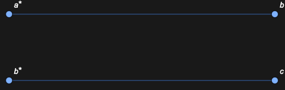

## Usage

<code>[DiagramsPortGraph](https://resources.wolframcloud.com/PacletRepository/resources/Wolfram/DiagrammaticComputation/ref/DiagramsPortGraph)[{$d_1$, …}]</code> returns the port graph of the list of diagrams — a graph whose vertices are individual ports and whose edges are the matchings between dual ports.

## Details & Options

- The port graph is the finest-grained graph view of a diagram network. Each diagram contributes one vertex per port.
- Use it as input to graph-theoretic queries (cycles, components, matchings) that do not care about subdiagram structure.

## Basic Examples

Port graph of two diagrams sharing a wire:

```wl
DiagramsPortGraph[{Diagram["A", a, b], Diagram["B", b, c]}]
```


