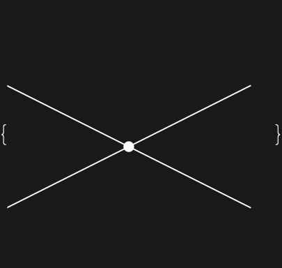

## Usage

<code>[FeynArtsTopologyGraphics](https://resources.wolframcloud.com/PacletRepository/resources/Wolfram/DiagrammaticComputation/ref/FeynArtsTopologyGraphics)[$topology$]</code> renders a FeynArts topology as <code>[Graphics](https://reference.wolfram.com/language/ref/Graphics.html)</code> in the FeynArts house style.

<code>[FeynArtsTopologyGraphics](https://resources.wolframcloud.com/PacletRepository/resources/Wolfram/DiagrammaticComputation/ref/FeynArtsTopologyGraphics)[$topology$ -> $insertions$]</code> renders one graphic per field insertion.

<code>[FeynArtsTopologyGraphics](https://resources.wolframcloud.com/PacletRepository/resources/Wolfram/DiagrammaticComputation/ref/FeynArtsTopologyGraphics)[$topologies$]</code> maps over a <code>TopologyList</code>.

## Details & Options

- The rendering goes through the FeynArts shape database and renderer (<code>[TopologyGraphics](https://resources.wolframcloud.com/PacletRepository/resources/Wolfram/DiagrammaticComputation/ref/TopologyGraphics)</code> + <code>FeynArts\`Graphics\`DoRender</code>), so the output matches what <code>FeynArts\`Paint</code> produces.
- Returns a list of <code>[Graphics](https://reference.wolfram.com/language/ref/Graphics.html)</code> objects, one per insertion (a single-element list when called on a bare topology).

## Basic Examples

Load FeynArts:

```wl
Needs["FeynArts`"]
FeynArts`$FAVerbose = 0;
```

Render a tree-level 2 -> 2 topology:

```wl
FeynArtsTopologyGraphics[First @ CreateTopologies[0, 2 -> 2]]
```



## Properties and Relations

For a structured <code>[Diagram](https://resources.wolframcloud.com/PacletRepository/resources/Wolfram/DiagrammaticComputation/ref/Diagram)</code> that supports composition and rewriting rather than a static picture, use <code>[FeynmanDiagram](https://resources.wolframcloud.com/PacletRepository/resources/Wolfram/DiagrammaticComputation/ref/FeynmanDiagram)</code>.
