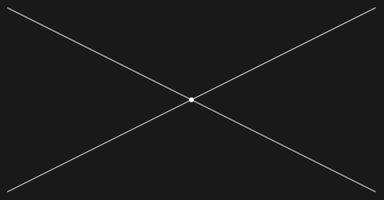
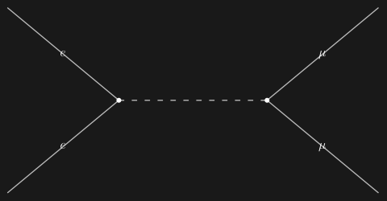

## Usage

<code>[FeynmanDiagram](https://resources.wolframcloud.com/PacletRepository/resources/Wolfram/DiagrammaticComputation/ref/FeynmanDiagram)[$graph$]</code> constructs a <code>[Diagram](https://resources.wolframcloud.com/PacletRepository/resources/Wolfram/DiagrammaticComputation/ref/Diagram)</code> network from the topology graph $graph$.

## Details & Options

- The $graph$ is a topology graph as produced by <code>[TopologyGraph](https://resources.wolframcloud.com/PacletRepository/resources/Wolfram/DiagrammaticComputation/ref/TopologyGraph)</code> or <code>[TopologyGraphs](https://resources.wolframcloud.com/PacletRepository/resources/Wolfram/DiagrammaticComputation/ref/TopologyGraphs)</code> -- its vertices are interaction points and external legs, its tagged edges are propagators.
- Each vertex becomes a subdiagram (a point for interaction vertices, an invisible node for external legs) and each propagator becomes a wire, rendered with the line style conventional for its FeynArts propagator type (wiggly for gauge bosons, dashed for scalars and ghosts, straight for fermions) via <code>[WigglyArcFunction](https://resources.wolframcloud.com/PacletRepository/resources/Wolfram/DiagrammaticComputation/ref/WigglyArcFunction)</code>.
- When the edges carry field insertions (from <code>FeynArts\`InsertFields</code> via <code>[TopologyGraphs](https://resources.wolframcloud.com/PacletRepository/resources/Wolfram/DiagrammaticComputation/ref/TopologyGraphs)</code>), the wires are labelled with the LaTeX-typeset field names.
- Additional options are passed through to <code>[DiagramNetwork](https://resources.wolframcloud.com/PacletRepository/resources/Wolfram/DiagrammaticComputation/ref/DiagramNetwork)</code>.

## Basic Examples

Load FeynArts:

```wl
Needs["FeynArts`"]
FeynArts`$FAVerbose = 0;
```

Build a Feynman diagram from a tree-level 2 -> 2 topology:

```wl
FeynmanDiagram[TopologyGraph[First @ CreateTopologies[0, 2 -> 2]]]
```



Insert Standard Model fields and draw the labelled diagram:

```wl
ins = InsertFields[CreateTopologies[0, 2 -> 2],
  {F[2, {1}], -F[2, {1}]} -> {F[2, {2}], -F[2, {2}]},
  InsertionLevel -> {Classes}];
FeynmanDiagram[First @ TopologyGraphs[ins]]
```



## Properties and Relations

The result is an ordinary <code>[Diagram](https://resources.wolframcloud.com/PacletRepository/resources/Wolfram/DiagrammaticComputation/ref/Diagram)</code>, so all diagram operations (composition, surgery, rewriting) apply. For pure FeynArts-style rendering without the diagram structure, use <code>[FeynArtsTopologyGraphics](https://resources.wolframcloud.com/PacletRepository/resources/Wolfram/DiagrammaticComputation/ref/FeynArtsTopologyGraphics)</code>.
