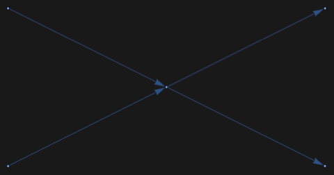

## Usage

<code>[TopologyGraph](https://resources.wolframcloud.com/PacletRepository/resources/Wolfram/DiagrammaticComputation/ref/TopologyGraph)[$topology$]</code> converts a FeynArts <code>Topology</code> object into a <code>[Graph](https://reference.wolfram.com/language/ref/Graph.html)</code>.

## Details & Options

- The $topology$ is a <code>FeynArts\`Topology[...]</code> expression as produced by <code>FeynArts\`CreateTopologies</code>.
- Incoming and outgoing external legs become <code>[DirectedEdge](https://reference.wolfram.com/language/ref/DirectedEdge.html)</code>s; internal propagators become <code>[UndirectedEdge](https://reference.wolfram.com/language/ref/UndirectedEdge.html)</code>s. Each edge is tagged with its propagator type and field content.
- Vertex coordinates are taken from the FeynArts shape data, so the graph lays out like the conventional FeynArts rendering.

## Basic Examples

Load FeynArts:

```wl
Needs["FeynArts`"]
FeynArts`$FAVerbose = 0;
```

Create the tree-level 2 -> 2 topologies and convert the first one to a graph:

```wl
top = First @ CreateTopologies[0, 2 -> 2];
TopologyGraph[top]
```



## Properties and Relations

<code>[TopologyGraphs](https://resources.wolframcloud.com/PacletRepository/resources/Wolfram/DiagrammaticComputation/ref/TopologyGraphs)</code> maps this conversion over a whole <code>TopologyList</code>, optionally applying field insertions. The resulting graph is the input format expected by <code>[FeynmanDiagram](https://resources.wolframcloud.com/PacletRepository/resources/Wolfram/DiagrammaticComputation/ref/FeynmanDiagram)</code>.
