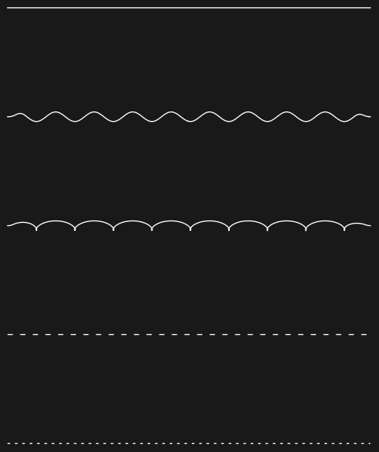
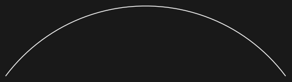

## Usage

<code>[WigglyArcFunction](https://resources.wolframcloud.com/PacletRepository/resources/Wolfram/DiagrammaticComputation/ref/WigglyArcFunction)[$shape$]</code> returns a function that renders a curve in the propagator line style $shape$.

<code>[WigglyArcFunction](https://resources.wolframcloud.com/PacletRepository/resources/Wolfram/DiagrammaticComputation/ref/WigglyArcFunction)[$shape$, $k$]</code> bends the curve into an arc with curvature $k$.

<code>[WigglyArcFunction](https://resources.wolframcloud.com/PacletRepository/resources/Wolfram/DiagrammaticComputation/ref/WigglyArcFunction)[$shape$, $k$, $arrow$]</code> adds an arrowhead with direction $arrow$ (1 forward, -1 backward, 0 none).

## Details & Options

- The returned function accepts a list of points or a curve primitive and produces graphics primitives.
- The $shape$ names follow the FeynArts propagator-type conventions:

| Shape | Rendering |
|---|---|
| <code>"Straight"</code> | plain line (fermions) |
| <code>"GhostDash"</code> | finely dashed line (ghosts) |
| <code>"ScalarDash"</code> | dashed line (scalars) |
| <code>"Sine"</code> | wiggly line (photons, gauge bosons) |
| <code>"Cycles"</code> | helix line (gluons) |

- Shapes other than the straight and dashed ones are rendered through the WiggleLine resource function, whose options (<code>"Amplitude"</code>, <code>"Frequency"</code>, <code>"TaperFraction"</code>, ...) can be passed through.
- <code>[FeynmanDiagram](https://resources.wolframcloud.com/PacletRepository/resources/Wolfram/DiagrammaticComputation/ref/FeynmanDiagram)</code> uses this function to draw each propagator according to its field type.

## Basic Examples

Render the standard propagator styles:

```wl
Graphics[{
  WigglyArcFunction["Straight"][{{0, 0}, {1, 0}}],
  WigglyArcFunction["Sine"][{{0, -0.3}, {1, -0.3}}],
  WigglyArcFunction["Cycles"][{{0, -0.6}, {1, -0.6}}],
  WigglyArcFunction["ScalarDash"][{{0, -0.9}, {1, -0.9}}],
  WigglyArcFunction["GhostDash"][{{0, -1.2}, {1, -1.2}}]
}]
```



Bend the line into an arc and add an arrowhead:

```wl
Graphics[WigglyArcFunction["Straight", 0.5, 1][{{0, 0}, {1, 0}}]]
```


