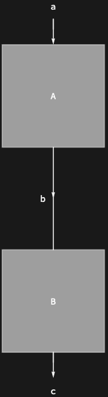
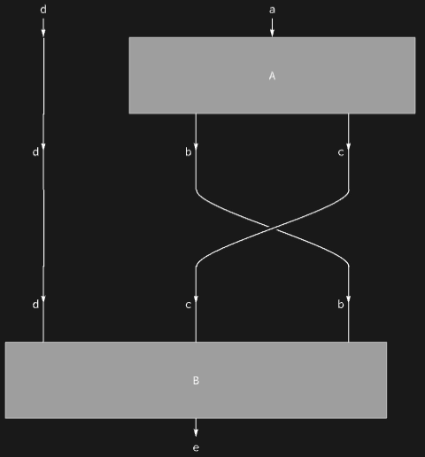

## Usage

<code>[ColumnDiagram](https://resources.wolframcloud.com/PacletRepository/resources/Wolfram/DiagrammaticComputation/ref/ColumnDiagram)[{$d_1$, $d_2$, ...}]</code> arranges the diagrams $d_i$ in a vertical column.

## Details & Options

- Equivalent in structure to <code>[DiagramComposition](https://resources.wolframcloud.com/PacletRepository/resources/Wolfram/DiagrammaticComputation/ref/DiagramComposition)[$d_1$, $d_2$, ...]</code> but with default port-arrow display tuned for a column layout.

## Basic Examples

A simple two-diagram column:

```wl
ColumnDiagram[{Diagram["A", a, b], Diagram["B", b, c]}]
```



A column whose pieces have different arity:

```wl
ColumnDiagram[{Diagram["A", a, {b, c}], Diagram["B", {d, c, b}, e]}]
```



## Properties and Relations

<code>[ColumnDiagram](https://resources.wolframcloud.com/PacletRepository/resources/Wolfram/DiagrammaticComputation/ref/ColumnDiagram)</code> is the layout-level counterpart of <code>[DiagramComposition](https://resources.wolframcloud.com/PacletRepository/resources/Wolfram/DiagrammaticComputation/ref/DiagramComposition)</code> (the algebraic sequential composition). For the horizontal version, see <code>[RowDiagram](https://resources.wolframcloud.com/PacletRepository/resources/Wolfram/DiagrammaticComputation/ref/RowDiagram)</code>.
