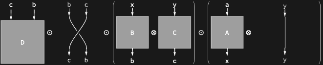
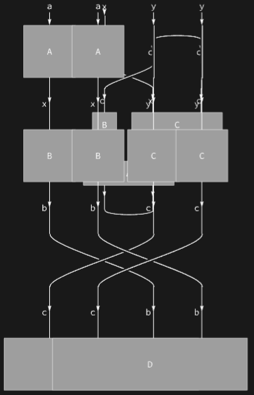

## Usage

<code>[DiagramArrange](https://resources.wolframcloud.com/PacletRepository/resources/Wolfram/DiagrammaticComputation/ref/DiagramArrange)[$d$]</code> rewrites the diagram $d$ into an equivalent diagram that can be laid out as a hierarchical grid, by inserting identity wires, permutations and (for networks) cap/cup/spider auxiliary diagrams.

## Details & Options

- Arrangement does not change the meaning of the diagram — only its presentation. Composition with <code>[DiagramGrid](https://resources.wolframcloud.com/PacletRepository/resources/Wolfram/DiagrammaticComputation/ref/DiagramGrid)</code> is the usual workflow: <code>[DiagramGrid](https://resources.wolframcloud.com/PacletRepository/resources/Wolfram/DiagrammaticComputation/ref/DiagramGrid) @ [DiagramArrange](https://resources.wolframcloud.com/PacletRepository/resources/Wolfram/DiagrammaticComputation/ref/DiagramArrange)[$d$]</code>.
- For ordinary compositions and products, <code>[DiagramArrange](https://resources.wolframcloud.com/PacletRepository/resources/Wolfram/DiagrammaticComputation/ref/DiagramArrange)</code> inserts <code>[IdentityDiagram](https://resources.wolframcloud.com/PacletRepository/resources/Wolfram/DiagrammaticComputation/ref/IdentityDiagram)</code> and <code>[PermutationDiagram](https://resources.wolframcloud.com/PacletRepository/resources/Wolfram/DiagrammaticComputation/ref/PermutationDiagram)</code> to align rows and columns.
- For networks, it additionally introduces <code>[CapDiagram](https://resources.wolframcloud.com/PacletRepository/resources/Wolfram/DiagrammaticComputation/ref/CapDiagram)</code>, <code>[CupDiagram](https://resources.wolframcloud.com/PacletRepository/resources/Wolfram/DiagrammaticComputation/ref/CupDiagram)</code> and <code>[SpiderDiagram](https://resources.wolframcloud.com/PacletRepository/resources/Wolfram/DiagrammaticComputation/ref/SpiderDiagram)</code> to make port matching explicit.

## Basic Examples

Arrangement of a composition introduces wires to align ports:

```wl
d = DiagramRightComposition[
  Diagram[A, a, x],
  DiagramProduct[Diagram[B, x, b], Diagram[C, y, c]],
  Diagram[D, {c, b}, {}]
];
DiagramDecompose @ DiagramArrange[d]
```



Arrangement of a network introduces caps, cups and spiders:

```wl
DiagramArrange @ DiagramNetwork[
  Diagram[A, {a, b}, {d, d}],
  Diagram[B, c, a],
  Diagram[C, {x, c}, b]
]
```



## Properties and Relations

The inverse of <code>[DiagramArrange](https://resources.wolframcloud.com/PacletRepository/resources/Wolfram/DiagrammaticComputation/ref/DiagramArrange)</code> is <code>[DiagramDecompose](https://resources.wolframcloud.com/PacletRepository/resources/Wolfram/DiagrammaticComputation/ref/DiagramDecompose)</code>, which recovers the underlying expression tree from an arranged diagram.
