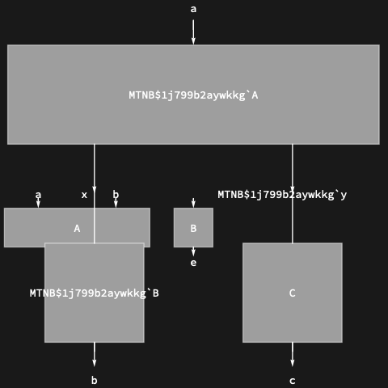
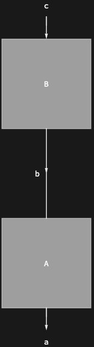
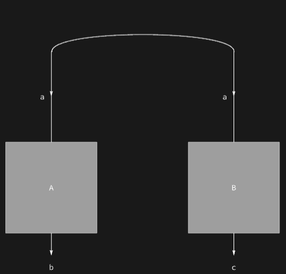
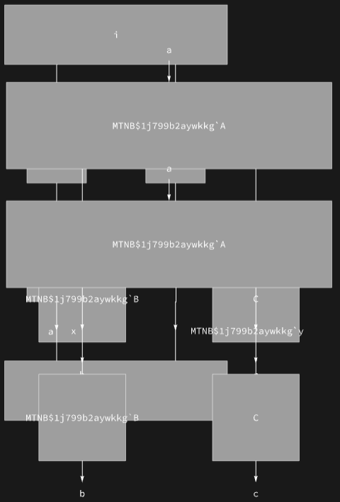
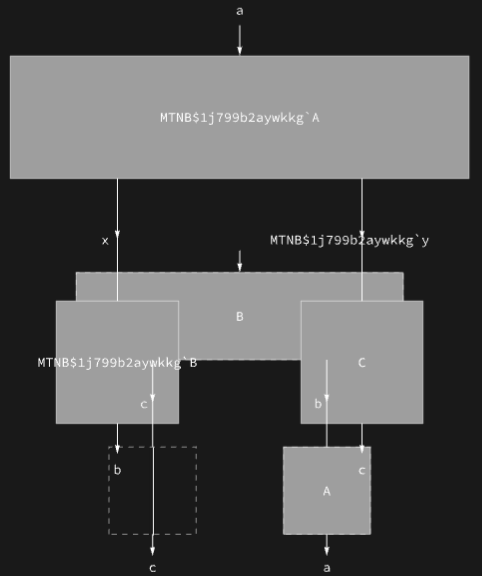
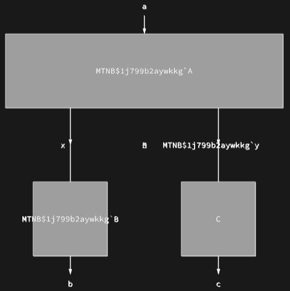
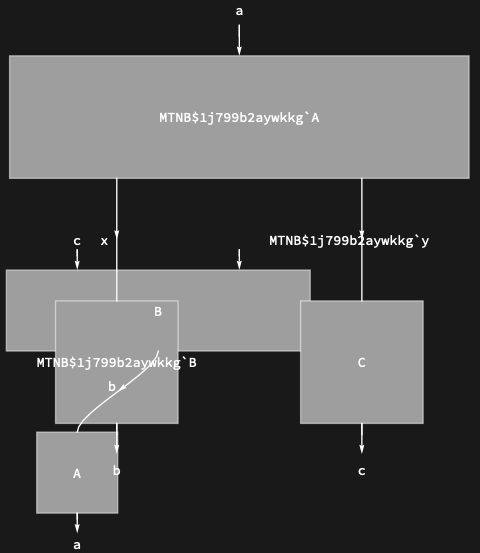
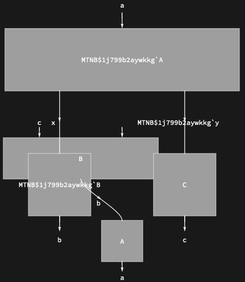

## Usage

<code>[DiagramGrid](https://resources.wolframcloud.com/PacletRepository/resources/Wolfram/DiagrammaticComputation/ref/DiagramGrid)[$d$]</code> arranges the diagram $d$ into a grid and returns its graphics representation, with composition running vertically and product running horizontally.

## Details & Options

- Each subdiagram is placed in a cell; wires are drawn between matching ports of adjacent cells. The grid expands automatically to accommodate compositions, products and nested structure.
- For diagrams that are not natively grid-arrangeable, first run <code>[DiagramArrange](https://resources.wolframcloud.com/PacletRepository/resources/Wolfram/DiagrammaticComputation/ref/DiagramArrange)</code> to insert identities, permutations and spiders.
- The following options are commonly used:

| Option | Default | Description |
|---|---|---|
| <code>"Outline"</code> | <code>[False]()</code> | dashed outline around auxiliary diagrams introduced by arrangement |
| <code>Dividers</code> | <code>[False]()</code> | grid dividers between subdiagram cells |
| <code>Alignment</code> | <code>Center</code> | alignment of sub-diagrams within their grid cells |

## Basic Examples

Render a product of two diagrams as a grid:

```wl
DiagramGrid @ DiagramProduct[Diagram["A", {a, b}, c], Diagram["B", d, e]]
```



Render a composition:

```wl
DiagramGrid @ DiagramComposition[Diagram["A", b, a], Diagram["B", c, b]]
```



Render a small network:

```wl
DiagramGrid[DiagramNetwork[Diagram["A", a, b], Diagram["B", a, c]]]
```



## Scope

Use <code>[DiagramComposition](https://resources.wolframcloud.com/PacletRepository/resources/Wolfram/DiagrammaticComputation/ref/DiagramComposition)</code> and <code>[DiagramProduct](https://resources.wolframcloud.com/PacletRepository/resources/Wolfram/DiagrammaticComputation/ref/DiagramProduct)</code> together to build a 2D arrangement:

```wl
DiagramGrid @ DiagramComposition[
  Diagram["g", {a, d}, x],
  DiagramProduct[DiagramComposition[Diagram["A", b, a], Diagram["B", c, b]], Diagram["h", e, d]],
  Diagram["i", {c, e}]
]
```



## Options

### "Outline"

Outlines all extra diagrams introduced to fill the grid:

```wl
DiagramGrid[DiagramComposition[Diagram["A", b, a], Diagram["B", d, {c, b}]], "Outline" -> True]
```



### Dividers

Show grid dividers separating sub-diagrams:

```wl
DiagramGrid[
  DiagramComposition[
    DiagramComposition[Diagram["A", b, a], Diagram["B", c, b]],
    DiagramProduct[Diagram["D", d], Diagram["C", c]]
  ],
  Dividers -> All
]
```



### Alignment

Align sub-diagrams within their grid cells:

```wl
DiagramGrid[DiagramComposition[Diagram["A", b, a], Diagram["B", {c, d}, b]], Alignment -> Left]
```



```wl
DiagramGrid[DiagramComposition[Diagram["A", b, a], Diagram["B", {c, d}, b]], Alignment -> Right]
```



## Properties and Relations

<code>[DiagramGrid](https://resources.wolframcloud.com/PacletRepository/resources/Wolfram/DiagrammaticComputation/ref/DiagramGrid)</code> is the multi-cell counterpart of <code>[DiagramGraphics](https://resources.wolframcloud.com/PacletRepository/resources/Wolfram/DiagrammaticComputation/ref/DiagramGraphics)</code>, which renders a diagram as a single opaque node. Use <code>[DiagramDecompose](https://resources.wolframcloud.com/PacletRepository/resources/Wolfram/DiagrammaticComputation/ref/DiagramDecompose)</code> to recover the underlying expression tree.
