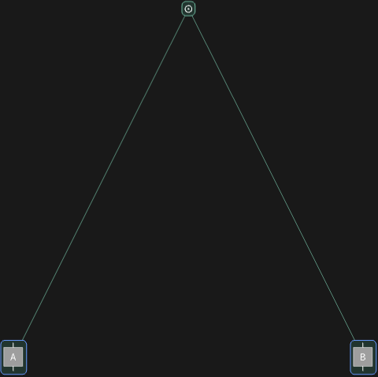

## Usage

<code>[DiagramGridTree](https://resources.wolframcloud.com/PacletRepository/resources/Wolfram/DiagrammaticComputation/ref/DiagramGridTree)[$d$]</code> returns the hierarchical tree of grid cells that <code>[DiagramGrid](https://resources.wolframcloud.com/PacletRepository/resources/Wolfram/DiagrammaticComputation/ref/DiagramGrid)</code> uses to render the diagram $d$.

## Details & Options

- Each node of the tree corresponds to a grid cell; leaf cells are singleton subdiagrams and inner cells are nested grids.
- Useful for inspecting or customising how a composite diagram will be laid out before calling <code>[DiagramGrid](https://resources.wolframcloud.com/PacletRepository/resources/Wolfram/DiagrammaticComputation/ref/DiagramGrid)</code>.

## Basic Examples

```wl
DiagramGridTree @ DiagramComposition[Diagram["A", b, a], Diagram["B", c, b]]
```


