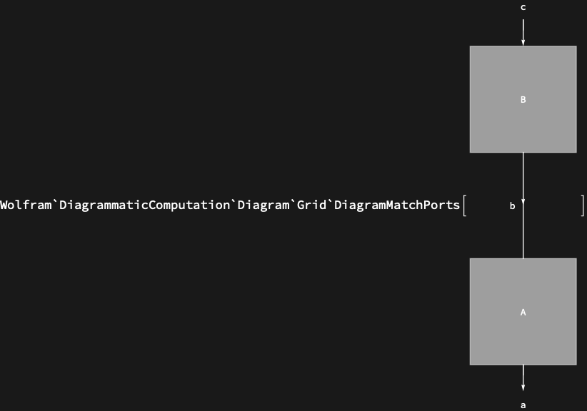

## Usage

<code>[DiagramMatchPorts](https://resources.wolframcloud.com/PacletRepository/resources/Wolfram/DiagrammaticComputation/ref/DiagramMatchPorts)[$d$]</code> aligns the ports of adjacent subdiagrams in a grid layout so that matching ports line up vertically.

## Details & Options

- A grid-layout helper used by <code>[DiagramGrid](https://resources.wolframcloud.com/PacletRepository/resources/Wolfram/DiagrammaticComputation/ref/DiagramGrid)</code> to decide how wires are drawn between adjacent cells. Useful directly when constructing custom layouts.

## Basic Examples

Align ports of a composition:

```wl
DiagramMatchPorts[DiagramComposition[Diagram["A", b, a], Diagram["B", c, b]]]
```


