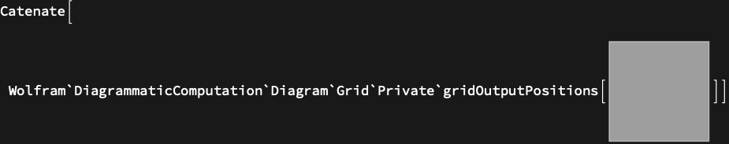

## Usage

<code>[GridOutputPorts](https://resources.wolframcloud.com/PacletRepository/resources/Wolfram/DiagrammaticComputation/ref/GridOutputPorts)[$d$]</code> returns the output ports of a diagram's grid layout, in the left-to-right order they appear along the bottom of the grid.

## Basic Examples

```wl
GridOutputPorts @ DiagramArrange @ DiagramComposition[Diagram["A", b, a], Diagram["B", c, b]]
```


