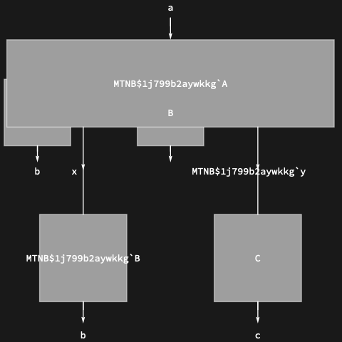
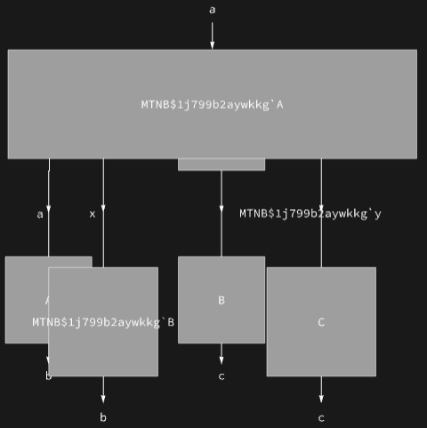

## Usage

<code>[RowDiagram](https://resources.wolframcloud.com/PacletRepository/resources/Wolfram/DiagrammaticComputation/ref/RowDiagram)[{$d_1$, $d_2$, …}]</code> arranges the diagrams $d_i$ in a horizontal row.

## Details & Options

- Equivalent in structure to <code>[DiagramProduct](https://resources.wolframcloud.com/PacletRepository/resources/Wolfram/DiagrammaticComputation/ref/DiagramProduct)[$d_1$, $d_2$, …]</code> but with default port-arrow display tuned for a row layout.

## Basic Examples

A simple two-diagram row:

```wl
RowDiagram[{Diagram["A", a, b], Diagram["B", c, d]}]
```



Nested compositions still appear in a row:

```wl
RowDiagram[{Diagram["A", a, b], DiagramComposition[Diagram["B", d, c], Diagram["C", e, d]]}]
```



## Properties and Relations

<code>[RowDiagram](https://resources.wolframcloud.com/PacletRepository/resources/Wolfram/DiagrammaticComputation/ref/RowDiagram)</code> is the layout-level counterpart of <code>[DiagramProduct](https://resources.wolframcloud.com/PacletRepository/resources/Wolfram/DiagrammaticComputation/ref/DiagramProduct)</code> (the algebraic parallel product). For the vertical version, see <code>[ColumnDiagram](https://resources.wolframcloud.com/PacletRepository/resources/Wolfram/DiagrammaticComputation/ref/ColumnDiagram)</code>.
