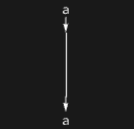
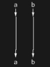
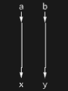

## Usage

<code>[IdentityDiagram](https://resources.wolframcloud.com/PacletRepository/resources/Wolfram/DiagrammaticComputation/ref/IdentityDiagram)[$p$]</code> creates an identity diagram with a single input port $p$ and matching output port -- a "pass-through wire" on $p$.

<code>[IdentityDiagram](https://resources.wolframcloud.com/PacletRepository/resources/Wolfram/DiagrammaticComputation/ref/IdentityDiagram)[{$p_1$, $p_2$, ...}]</code> creates a diagram consisting of multiple identities, one per port.

<code>[IdentityDiagram](https://resources.wolframcloud.com/PacletRepository/resources/Wolfram/DiagrammaticComputation/ref/IdentityDiagram)[$p$ -> $q$]</code> creates an identity-shaped diagram with input port $p$ and output port $q$.

<code>[IdentityDiagram](https://resources.wolframcloud.com/PacletRepository/resources/Wolfram/DiagrammaticComputation/ref/IdentityDiagram)[{$p_1$, ..., $p_n$} -> {$q_1$, ..., $q_n$}]</code> creates a parallel bundle of identities with the specified input and output ports.

## Details & Options

- The identity diagram is the unit of <code>[DiagramComposition](https://resources.wolframcloud.com/PacletRepository/resources/Wolfram/DiagrammaticComputation/ref/DiagramComposition)</code>: <code>[DiagramComposition](https://resources.wolframcloud.com/PacletRepository/resources/Wolfram/DiagrammaticComputation/ref/DiagramComposition)[[IdentityDiagram]()[$p$], $d$] == $d$</code> whenever $d$ has output port $p$.
- Rendered as a single wire -- its shape is <code>"Wires"[{{1, 2}}]</code>.

## Basic Examples

Make an identity diagram:

```wl
IdentityDiagram[a]
```



Rename ports across an identity:

```wl
IdentityDiagram[a -> b]
```


Multiple identities in parallel:

```wl
IdentityDiagram[{a, b}]
```



A parallel bundle with renaming:

```wl
IdentityDiagram[{a, b} -> {x, y}]
```



## Properties and Relations

<code>[PermutationDiagram](https://resources.wolframcloud.com/PacletRepository/resources/Wolfram/DiagrammaticComputation/ref/PermutationDiagram)</code> generalises <code>[IdentityDiagram](https://resources.wolframcloud.com/PacletRepository/resources/Wolfram/DiagrammaticComputation/ref/IdentityDiagram)</code> by allowing a non-trivial reordering of ports.
