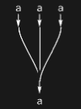

## Usage

<code>[MergeDiagram](https://resources.wolframcloud.com/PacletRepository/resources/Wolfram/DiagrammaticComputation/ref/MergeDiagram)[$p$, $n$]</code> creates a diagram with $n$ input copies of $p$ merged into a single output port.

<code>[MergeDiagram](https://resources.wolframcloud.com/PacletRepository/resources/Wolfram/DiagrammaticComputation/ref/MergeDiagram)[{$p_1$, …, $p_n$}, $q$]</code> merges the explicit input ports $p_1, …, p_n$ into $q$.

## Details & Options

- A merge diagram is a special case of <code>[SpiderDiagram](https://resources.wolframcloud.com/PacletRepository/resources/Wolfram/DiagrammaticComputation/ref/SpiderDiagram)</code> with many inputs and one output.
- It is the multiplication morphism of a Frobenius / classical-structure on its wire.

## Basic Examples

A 3-to-1 merge:

```wl
MergeDiagram[a, 3]
```



## Properties and Relations

The dual operation is <code>[CopyDiagram](https://resources.wolframcloud.com/PacletRepository/resources/Wolfram/DiagrammaticComputation/ref/CopyDiagram)</code>. Together they form a commutative Frobenius algebra on the wire.
