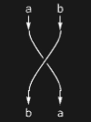
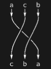
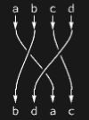
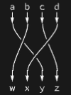
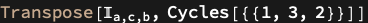

## Usage

<code>[PermutationDiagram](https://resources.wolframcloud.com/PacletRepository/resources/Wolfram/DiagrammaticComputation/ref/PermutationDiagram)[{$p_1$, $p_2$, ...}]</code> creates a diagram connecting the input ports $p_i$ to their ordered sequence as outputs.

<code>[PermutationDiagram](https://resources.wolframcloud.com/PacletRepository/resources/Wolfram/DiagrammaticComputation/ref/PermutationDiagram)[{$p_1$, ..., $p_n$} -> {$p_{i_1}$, ..., $p_{i_n}$}]</code> provides input ports and their explicit permutation as outputs.

<code>[PermutationDiagram](https://resources.wolframcloud.com/PacletRepository/resources/Wolfram/DiagrammaticComputation/ref/PermutationDiagram)[{$p_1$, ...}, $perm$]</code> applies the permutation $perm$ (as <code>[Cycles](https://reference.wolfram.com/language/ref/Cycles.html)</code> or list) to the input ports.

<code>[PermutationDiagram](https://resources.wolframcloud.com/PacletRepository/resources/Wolfram/DiagrammaticComputation/ref/PermutationDiagram)[{$p_1$, ..., $p_n$}, {$q_1$, ..., $q_n$}, $perm$]</code> permutes the inputs and renames the outputs.

## Details & Options

- Permutation diagrams are pure wires with crossings; they have no internal node and rendered shape <code>"Wires"[...]</code>.
- They carry an <code>Interpretation["\[Pi]", ...]</code> label so the underlying permutation is preserved through composition.

## Basic Examples

A simple swap:

```wl
PermutationDiagram[{b, a}]
```



Explicit input -> output permutation:

```wl
PermutationDiagram[{a, c, b} -> {c, b, a}]
```



Using a <code>[Cycles](https://reference.wolfram.com/language/ref/Cycles.html)</code> permutation:

```wl
PermutationDiagram[{a, b, c, d}, Cycles[{{1, 3, 4, 2}}]]
```



Permute and rename:

```wl
PermutationDiagram[{a, b, c, d}, {w, x, y, z}, Cycles[{{1, 3, 4, 2}}]]
```



## Scope

A permutation diagram has default functional and tensorial representations:

```wl
DiagramFunction @ PermutationDiagram[{a, c, b} -> {c, b, a}]
```


```wl
DiagramTensor @ PermutationDiagram[{a, c, b} -> {c, b, a}]
```



## Properties and Relations

<code>[PermutationDiagram](https://resources.wolframcloud.com/PacletRepository/resources/Wolfram/DiagrammaticComputation/ref/PermutationDiagram)</code> generalises <code>[IdentityDiagram](https://resources.wolframcloud.com/PacletRepository/resources/Wolfram/DiagrammaticComputation/ref/IdentityDiagram)</code> and provides the braiding morphisms in the symmetric monoidal structure.
