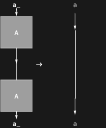

## Usage

<code>[AnnihilationRule](https://resources.wolframcloud.com/PacletRepository/resources/Wolfram/DiagrammaticComputation/ref/AnnihilationRule)[$d_1$, $d_2$]</code> returns a rewrite rule annihilating the facing diagrams $d_1$ and $d_2$ into identity wires.

<code>[AnnihilationRule](https://resources.wolframcloud.com/PacletRepository/resources/Wolfram/DiagrammaticComputation/ref/AnnihilationRule)[$expr_1$, $expr_2$, {$x_1$, ..., $x_n$}, {$y_1$, ..., $y_n$}]</code> annihilates nodes labelled $expr_1$ and $expr_2$ with legs $x_i$ and $y_i$.

## Details & Options

- Encodes the interaction-net annihilation law: two matching nodes meeting head-on disappear, joining their remaining legs pairwise.
- The following options can be given:

| Option | Default | Description |
|---|---|---|
| <code>"Bend"</code> | <code>[False]()</code> | bend the second node up with a cup |
| <code>"Reverse"</code> | <code>[False]()</code> | reverse the pairing of the legs |
| <code>"Polarized"</code> | <code>[True]()</code> | show port direction arrows |
| <code>"Floating"</code> | <code>[True]()</code> | allow node ports to match in any order |

## Basic Examples

Self-annihilation of a unary involution:

```wl
AnnihilationRule[Diagram["A", a, a]]
```



## Properties and Relations

<code>[DuplicateAnnihilationRule](https://resources.wolframcloud.com/PacletRepository/resources/Wolfram/DiagrammaticComputation/ref/DuplicateAnnihilationRule)</code> and <code>[EraserAnnihilationRule](https://resources.wolframcloud.com/PacletRepository/resources/Wolfram/DiagrammaticComputation/ref/EraserAnnihilationRule)</code> are the special cases for copy and erase nodes.
