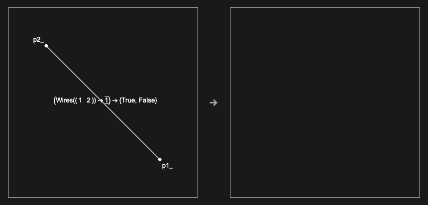

## Usage

<code>[DiagramHypergraphRule](https://resources.wolframcloud.com/PacletRepository/resources/Wolfram/DiagrammaticComputation/ref/DiagramHypergraphRule)[$rule$]</code> returns the hypergraph form of a <code>[DiagramRule](https://resources.wolframcloud.com/PacletRepository/resources/Wolfram/DiagrammaticComputation/ref/DiagramRule)</code>, exposing how the LHS and RHS are matched by the rewriting engine.

## Details & Options

- Useful for debugging rules: inspect this representation when a rule unexpectedly fails to match.

## Basic Examples

Hypergraph form of an identity-elimination rule:

```wl
DiagramHypergraphRule @ DiagramRule[IdentityDiagram[a], EmptyDiagram[]]
```


