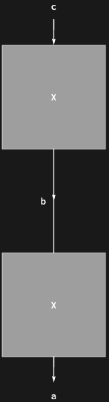

## Usage

<code>[DiagramNestReplace](https://resources.wolframcloud.com/PacletRepository/resources/Wolfram/DiagrammaticComputation/ref/DiagramNestReplace)[$d$, {$rule_1$, ...}, $n$]</code> applies the rewrite rules to $d$ up to $n$ times, returning the result.

## Details & Options

- The diagram analogue of <code>[ReplaceRepeated](https://reference.wolfram.com/language/ref/ReplaceRepeated.html)</code> with an iteration cap: at each step the first matching rule fires at its first match site.
- For non-confluent rule sets, the choice of which match to rewrite at each step affects the final form -- use <code>[DiagramReplaceList](https://resources.wolframcloud.com/PacletRepository/resources/Wolfram/DiagrammaticComputation/ref/DiagramReplaceList)</code> for branching exploration.

## Basic Examples

Apply a rule twice, rewriting both occurrences of <code>"A"</code>:

```wl
DiagramNestReplace[
  DiagramComposition[Diagram["A", b, a], Diagram["A", c, b]],
  {Diagram["A", \[FormalY], \[FormalX]] -> Diagram["X", \[FormalY], \[FormalX]]},
  2
]
```


