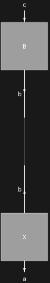

## Usage

<code>[DiagramReplace](https://resources.wolframcloud.com/PacletRepository/resources/Wolfram/DiagrammaticComputation/ref/DiagramReplace)[$d$, $src$ -> $tgt$]</code> rewrites the first match of the diagram $src$ in $d$ to $tgt$.

<code>[DiagramReplace](https://resources.wolframcloud.com/PacletRepository/resources/Wolfram/DiagrammaticComputation/ref/DiagramReplace)[$d$, {$rule_1$, $rule_2$, ...}]</code> tries each rule in turn, applying the first that matches.

<code>[DiagramReplace](https://resources.wolframcloud.com/PacletRepository/resources/Wolfram/DiagrammaticComputation/ref/DiagramReplace)[$rule$][$d$]</code> is the operator form.

## Details & Options

- Matching is performed against the hypergraph view of $d$ (<code>[DiagramHypergraph](https://resources.wolframcloud.com/PacletRepository/resources/Wolfram/DiagrammaticComputation/ref/DiagramHypergraph)</code>), so port names in the rule bind to the matched wiring rather than having to match literally.
- If no rule matches, $d$ is returned unchanged.
- Only the *first* match is rewritten. To enumerate every possible single rewrite use <code>[DiagramReplaceList](https://resources.wolframcloud.com/PacletRepository/resources/Wolfram/DiagrammaticComputation/ref/DiagramReplaceList)</code>; to apply rules repeatedly use <code>[DiagramNestReplace](https://resources.wolframcloud.com/PacletRepository/resources/Wolfram/DiagrammaticComputation/ref/DiagramNestReplace)</code>.

## Basic Examples

Replace a subdiagram inside a composition:

```wl
DiagramReplace[
  DiagramComposition[Diagram["A", b, a], Diagram["B", c, b]],
  Diagram["A", \[FormalY], \[FormalX]] -> Diagram["X", \[FormalY], \[FormalX]]
]
```


