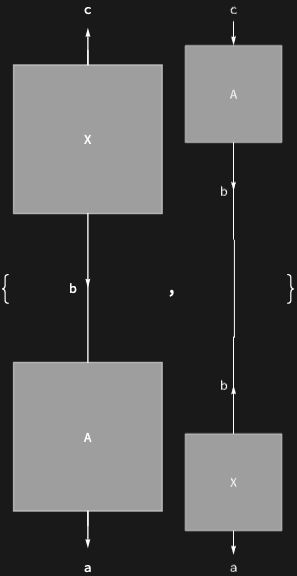

## Usage

<code>[DiagramReplaceList](https://resources.wolframcloud.com/PacletRepository/resources/Wolfram/DiagrammaticComputation/ref/DiagramReplaceList)[$d$, $src$ -> $tgt$]</code> returns a list of every possible single rewrite of $d$ replacing a match of the diagram $src$ with $tgt$.

<code>[DiagramReplaceList](https://resources.wolframcloud.com/PacletRepository/resources/Wolfram/DiagrammaticComputation/ref/DiagramReplaceList)[$d$, $rule$, $n$]</code> returns at most $n$ rewrites.

<code>[DiagramReplaceList](https://resources.wolframcloud.com/PacletRepository/resources/Wolfram/DiagrammaticComputation/ref/DiagramReplaceList)[$d$, {$rule_1$, $rule_2$, …}]</code> enumerates rewrites for each of the given rules.

## Details & Options

- Matching is performed on the hypergraph view of $d$, so each list entry corresponds to one match site of $src$ in $d$.
- Formal symbols (or patterns) in the rule's ports are bound by the match, so a single rule can rewrite differently-wired occurrences of the same subdiagram.
- The following options can be given:

| Option | Default | Description |
|---|---|---|
| <code>"Return"</code> | <code>[Automatic]()</code> | return <code>"Rule"</code>, <code>"Hypergraph"</code> or <code>"Matches"</code> to inspect intermediate stages |
| <code>"IgnoreArity"</code> | <code>[True]()</code> | match subdiagrams regardless of unconnected ports |

## Basic Examples

List both possible single replacements of <code>"A"</code> in a composition of two:

```wl
DiagramReplaceList[
  DiagramComposition[Diagram["A", b, a], Diagram["A", c, b]],
  Diagram["A", \[FormalY], \[FormalX]] -> Diagram["X", \[FormalY], \[FormalX]]
]
```


