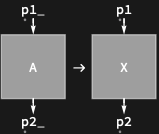
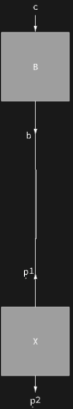

## Usage

<code>[DiagramRule](https://resources.wolframcloud.com/PacletRepository/resources/Wolfram/DiagrammaticComputation/ref/DiagramRule)[$src$, $tgt$]</code> constructs a rewrite rule replacing diagrams matching $src$ with $tgt$, aligning their ports.

<code>[DiagramRule](https://resources.wolframcloud.com/PacletRepository/resources/Wolfram/DiagrammaticComputation/ref/DiagramRule)[$src$ -> $tgt$]</code> is an equivalent form.

## Details & Options

- The result is an ordinary <code>$src$ -> $tgt$</code> rule whose two sides have been arranged to share port wiring, ready for <code>[DiagramReplace](https://resources.wolframcloud.com/PacletRepository/resources/Wolfram/DiagrammaticComputation/ref/DiagramReplace)</code> / <code>[DiagramReplaceList](https://resources.wolframcloud.com/PacletRepository/resources/Wolfram/DiagrammaticComputation/ref/DiagramReplaceList)</code> / <code>[DiagramNestReplace](https://resources.wolframcloud.com/PacletRepository/resources/Wolfram/DiagrammaticComputation/ref/DiagramNestReplace)</code>.
- Formal symbols in port positions act as pattern variables bound by the hypergraph matcher.
- Use <code>[RemoveDiagramRule](https://resources.wolframcloud.com/PacletRepository/resources/Wolfram/DiagrammaticComputation/ref/RemoveDiagramRule)</code> to build a rule that simply deletes a matched subdiagram.

## Basic Examples

A rule renaming a process while preserving its wiring:

```wl
DiagramRule[Diagram["A", \[FormalY], \[FormalX]], Diagram["X", \[FormalY], \[FormalX]]]
```



Use it with <code>[DiagramReplace](https://resources.wolframcloud.com/PacletRepository/resources/Wolfram/DiagrammaticComputation/ref/DiagramReplace)</code>:

```wl
DiagramReplace[
  DiagramComposition[Diagram["A", b, a], Diagram["B", c, b]],
  DiagramRule[Diagram["A", \[FormalY], \[FormalX]], Diagram["X", \[FormalY], \[FormalX]]]
]
```


