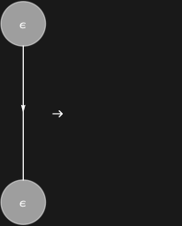

## Usage

<code>[EraserAnnihilationRule](https://resources.wolframcloud.com/PacletRepository/resources/Wolfram/DiagrammaticComputation/ref/EraserAnnihilationRule)[]</code> returns a rewrite rule annihilating two facing <code>[EraserDiagram](https://resources.wolframcloud.com/PacletRepository/resources/Wolfram/DiagrammaticComputation/ref/EraserDiagram)</code>s into nothing.

## Details & Options

- Encodes the interaction-net erase–erase law: an eraser meeting another eraser head-on leaves the empty diagram.
- Options of <code>[AnnihilationRule](https://resources.wolframcloud.com/PacletRepository/resources/Wolfram/DiagrammaticComputation/ref/AnnihilationRule)</code> are accepted.

## Basic Examples

The eraser annihilation law:

```wl
EraserAnnihilationRule[]
```


