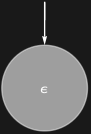

## Usage

<code>[EraserDiagram](https://resources.wolframcloud.com/PacletRepository/resources/Wolfram/DiagrammaticComputation/ref/EraserDiagram)[$p$]</code> is the canonical erase / discard diagram on the port $p$ — one input, no outputs.

## Details & Options

- The eraser is the counit of the classical-structure on a wire: composing it with <code>[CopyDiagram](https://resources.wolframcloud.com/PacletRepository/resources/Wolfram/DiagrammaticComputation/ref/CopyDiagram)</code> projects out one of the copies.
- Together with <code>[CopyDiagram](https://resources.wolframcloud.com/PacletRepository/resources/Wolfram/DiagrammaticComputation/ref/CopyDiagram)</code> and <code>[MergeDiagram](https://resources.wolframcloud.com/PacletRepository/resources/Wolfram/DiagrammaticComputation/ref/MergeDiagram)</code> it generates the standard structural rewrites in <code>[EraserRule](https://resources.wolframcloud.com/PacletRepository/resources/Wolfram/DiagrammaticComputation/ref/EraserRule)</code> and friends.

## Basic Examples

```wl
EraserDiagram[a]
```


