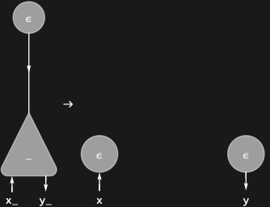

## Usage

<code>[EraserRule](https://resources.wolframcloud.com/PacletRepository/resources/Wolfram/DiagrammaticComputation/ref/EraserRule)[{$p_1$, $p_2$, ...}]</code> returns a rewrite rule that propagates an <code>[EraserDiagram](https://resources.wolframcloud.com/PacletRepository/resources/Wolfram/DiagrammaticComputation/ref/EraserDiagram)</code> through a process with ports $p_1, p_2, ...$, erasing it port by port.

## Details & Options

- Encodes the interaction-net erase law: a process meeting an eraser on one wire is replaced by erasers on all its other wires.
- A dual port (<code>SuperStar</code>) marks the side on which the eraser arrives.
- Options of <code>[CommutationRule](https://resources.wolframcloud.com/PacletRepository/resources/Wolfram/DiagrammaticComputation/ref/CommutationRule)</code> (such as <code>"Polarized"</code> and <code>"Floating"</code>) are accepted.

## Basic Examples

The erase law for a binary process:

```wl
EraserRule[{SuperStar[x], y}]
```


