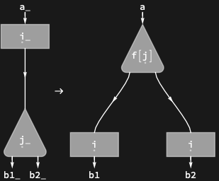

## Usage

<code>[PropagationRule](https://resources.wolframcloud.com/PacletRepository/resources/Wolfram/DiagrammaticComputation/ref/PropagationRule)[$a$, {$b_1$, ..., $b_n$}, $f$]</code> returns a rewrite rule propagating a unary process with input $a$ through an $n$-ary node with outputs $b_1, ..., b_n$, applying $f$ to the node's label.

## Details & Options

- Encodes the interaction-net commutation law: the process is duplicated onto each branch of the node, and the node's label is transformed by $f$ as it passes through.
- The following options can be given:

| Option | Default | Description |
|---|---|---|
| <code>"Polarized"</code> | <code>[True]()</code> | show port direction arrows |
| <code>"Floating"</code> | <code>[True]()</code> | allow node ports to match in any order |

## Basic Examples

Propagation of a unary process through a binary node:

```wl
PropagationRule[a, {b1, b2}, f]
```


