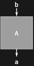

## Usage

<code>[SimplifyDiagram](https://resources.wolframcloud.com/PacletRepository/resources/Wolfram/DiagrammaticComputation/ref/SimplifyDiagram)[$d$]</code> simplifies the diagram $d$ by absorbing identity wires and other trivially-redundant structure.

## Details & Options

- Removes <code>[IdentityDiagram](https://resources.wolframcloud.com/PacletRepository/resources/Wolfram/DiagrammaticComputation/ref/IdentityDiagram)</code> wires from compositions and contracts unary spiders, leaving a structurally simpler diagram with the same meaning.
- Does *not* apply rewriting rules -- those go through <code>[DiagramReplace](https://resources.wolframcloud.com/PacletRepository/resources/Wolfram/DiagrammaticComputation/ref/DiagramReplace)</code> / <code>[DiagramNestReplace](https://resources.wolframcloud.com/PacletRepository/resources/Wolfram/DiagrammaticComputation/ref/DiagramNestReplace)</code>.

## Basic Examples

Remove an identity wire from a composition:

```wl
SimplifyDiagram[DiagramComposition[IdentityDiagram[a], Diagram["A", b, a]]]
```


